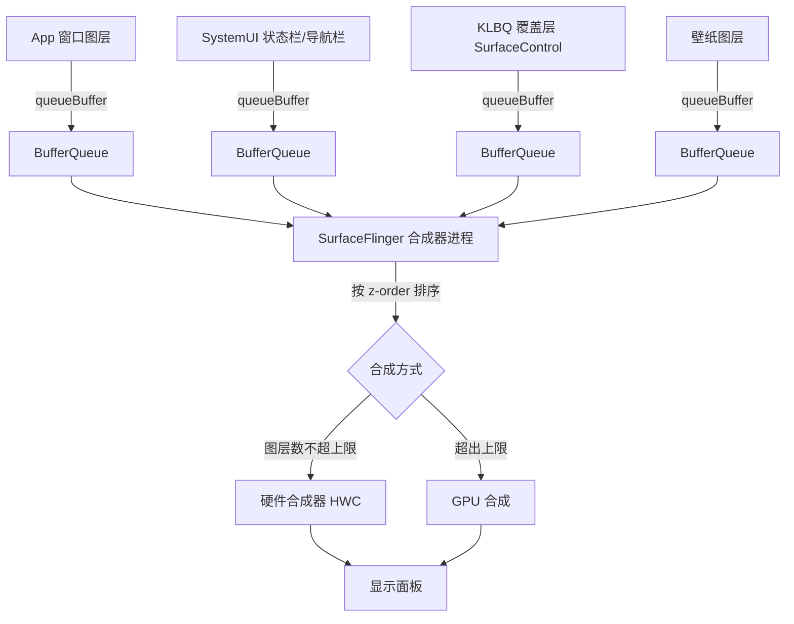
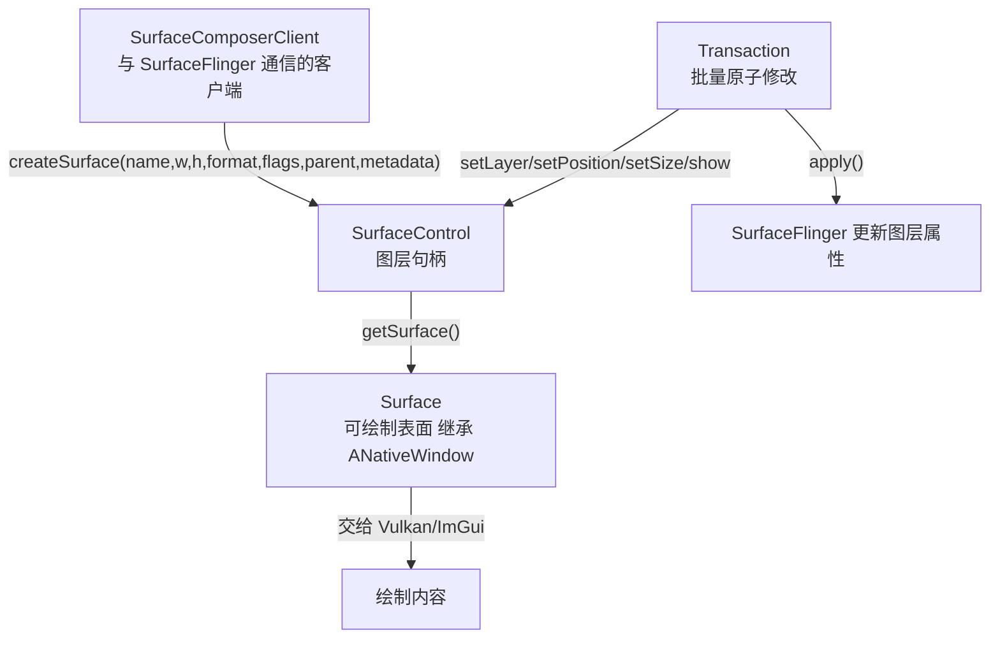

# 第 64 章 · SurfaceFlinger 与图层

> [!abstract] 本章目标
> 理解 Android 屏幕合成的完整机制，以及"图层"到底是什么。
> 第 65 章直接用原生 API 创建图层。

> [!note] 承上
> 前几章在"应用内部"画图。
> 本章走到**应用之外**——Android 的合成器 SurfaceFlinger 怎么把"图层"叠成屏幕。

> [!important] 本章概念多，分三次读
> 本章有 11 个新概念（SurfaceFlinger、BufferQueue、ANativeWindow、4 个 C++ 类、
> layerStack、z-order、像素格式、HWC），一次啃完会晕。**按三层分批读**：
>
> | 遍 | 读哪几节 | 目标 |
> |---|---|---|
> | **第一遍（必读）** | 「SurfaceFlinger 是什么」「BufferQueue」「图层属性」「z-order」 | 搞清"图层是什么、谁管图层" |
> | **第二遍（动手时读）** | 「关键 C++ 类」「标准创建流程」 | 搞清"怎么创建图层" |
> | **第三遍（进阶）** | 「硬件合成 vs GPU 合成」「显示设备与 layerStack」 | 搞清"合成与多屏" |
>
> 「用 dumpsys 观察图层」「像素格式」两节随时可查，不用一次记全。
> **先跑通第一遍，再来读第二遍**——比一口气读完有效得多。

## 先看一屏画面由什么组成

你看到的手机屏幕，通常是**多个图层叠在一起**：

```
z-order 高
    ┌──────────────────┐
    │  状态栏           │   SystemUI 的图层
    ├──────────────────┤
    │  悬浮窗/覆盖层     │   ← 我们要创建的
    ├──────────────────┤
    │  游戏画面         │   App 的图层
    ├──────────────────┤
    │  壁纸             │
    └──────────────────┘
z-order 低
```

SurfaceFlinger 负责把它们合成，输出到屏幕。

## SurfaceFlinger 是什么

> [!tip] 先看图，再看文字
> SurfaceFlinger 是**所有可见内容的汇聚点**——各 App/系统组件都不直接通信，
> 而是把各自的图形缓冲交给它，由它统一合成：



一个**系统服务进程**（不是库）：

```bash
adb shell ps -A | grep surfaceflinger
# system  1234  1  ... S surfaceflinger
```

它做的事：

```
1. 接收各 App/系统组件提交的图形缓冲
2. 按 z-order 排序
3. 决定用 GPU 还是硬件合成器（HWC）合成
4. 输出到显示面板
```

**App 之间不直接通信，都把内容交给 SurfaceFlinger。**

## BufferQueue：生产者-消费者

每个图层背后是一个 BufferQueue：

```
┌───────────────┐                    ┌──────────────────┐
│  生产者         │                    │  消费者            │
│  (你的程序)     │                    │  (SurfaceFlinger) │
│                │                    │                  │
│ dequeueBuffer  │ ←── 空闲缓冲 ──────│                  │
│ 往里绘制        │                    │                  │
│ queueBuffer    │ ──── 已填充 ──────→│ 合成              │
│                │                    │  releaseBuffer    │
└───────────────┘                    └──────────────────┘
```

三个状态的缓冲：

| 状态 | 含义 |
|---|---|
| FREE | 空闲，可被 dequeue |
| DEQUEUED | 生产者正在画 |
| QUEUED | 画完，等消费者取 |
| ACQUIRED | 消费者正在用 |

通常 2~3 个缓冲轮转（对应交换链的双/三缓冲）。

## ANativeWindow：生产者的接口

NDK 提供的 `ANativeWindow` 就是 BufferQueue 的生产者端封装：

```cpp
#include <android/native_window.h>

ANativeWindow *window = ...;

// 取出一块缓冲来画
ANativeWindow_Buffer buffer;
ARect dirty = {0, 0, w, h};
ANativeWindow_lock(window, &buffer, &dirty);
// 直接写 buffer.bits（CPU 软件绘制）
ANativeWindow_unlockAndPost(window);
```

或者交给 Vulkan/OpenGL（GPU 绘制）：

```cpp
// Vulkan
vkCreateAndroidSurfaceKHR(instance, &info, nullptr, &surface);
```

**两种方式对应同一个 BufferQueue。**

## 关键 C++ 类（libgui.so）

> [!tip] 图层创建的调用链
> 从客户端到屏幕，涉及 4 个 libgui 类。**关系图**如下（第 65 章用 `dlsym` 调这些符号）：



Android 的原生图形层是 C++（不是 NDK 公开 API）：

| 类 | 作用 |
|---|---|
| `SurfaceComposerClient` | 与 SurfaceFlinger 通信的客户端 |
| `SurfaceControl` | 一个图层的句柄 |
| `Surface` | 图层里的可绘制表面（继承 `ANativeWindow`） |
| `Transaction` | 批量修改图层属性并原子提交 |

关系：

```
SurfaceComposerClient
    │  createSurface(name, w, h, format, flags)
    ↓
SurfaceControl  ──getSurface()──→  Surface (ANativeWindow)
    │
    │  Transaction{ setLayer, setPosition, ... }.apply()
    ↓
  SurfaceFlinger 更新图层属性
```

## 标准创建流程（C++）

```cpp
#include <gui/SurfaceComposerClient.h>
#include <gui/SurfaceControl.h>
#include <ui/DisplayInfo.h>

using namespace android;

// 1. 创建客户端（连接 SurfaceFlinger）
sp<SurfaceComposerClient> client = new SurfaceComposerClient();
if (client->initCheck() != NO_ERROR) { /* 失败 */ }

// 2. 创建图层（真实项目 ANativeWindowCreator.h 的调用形态）
//    第 5 个参数是"像素格式"，项目里写的是整数 1（= RGBA_8888）
int32_t pixelFormat = 1;   // RGBA_8888
sp<SurfaceControl> sc = client->createSurface(
    String8("MyOverlay"),      // 名字
    1080, 2400,                // 宽高
    pixelFormat,               // 像素格式（1 = RGBA_8888）
    0,                         // windowFlags（skipScreenshot 时 |= 0x40）
    nullptr,                   // parent（nullptr = 顶层）
    LayerMetadata{},           // 元数据（Android 10+）
    nullptr);                  // outTransformHint

// 3. 配置图层
SurfaceComposerClient::Transaction t;
// 真实项目：层级 = INT_MAX - (rand() % 1000)，即在最高层附近随机取，
// 避免每次启动都撞同一个 z（ANativeWindowCreator.h 的 CreateSurface）
int32_t layerLevel = INT_MAX - (rand() % 1000);
t.setLayer(sc, layerLevel);
t.setPosition(sc, 0, 0);
t.setSize(sc, 1080, 2400);
t.show(sc);
t.apply();                                 // 原子提交

// 4. 拿到 ANativeWindow 来绘制
ANativeWindow *window = sc->getSurface().get();
```

> [!note] 参数个数/类型随版本变
> 上面的形态接近 Android 11+。**不同版本参数不同**（这就是第 66 章那张版本表要解决的问题）。
> 项目把"像素格式"写成整数 `1`（= RGBA_8888），而不是 `PIXEL_FORMAT_RGBA_8888` 常量名——
> 因为枚举值就是 1，直接写数字更省事（也规避了头文件缺失的问题）。

> [!warning] 这不是 NDK 公开 API
> `libgui.so` 是系统私有库：
> - App（.so）在 Android 7+ 无法 `dlopen`（第 32 章）
> - **原生可执行文件可以**
> - 符号名随版本变化（第 66 章解决）

## 图层属性

`Transaction` 能设置很多东西：

| 方法 | 作用 |
|---|---|
| `setLayer(z)` | z-order，越大越靠上 |
| `setPosition(x, y)` | 位置 |
| `setSize(w, h)` | 尺寸 |
| `setAlpha(a)` | 整体透明度 |
| `setFlags(...)` | 各种标志 |
| `setMatrix(...)` | 变换矩阵 |
| `setCrop(...)` | 裁剪区域 |
| `setLayerStack(id)` | 显示到哪个屏幕 |
| `setMetadata(...)` | 元数据（Android 10+） |
| `show()` / `hide()` | 显示/隐藏 |

**`Transaction` 是原子的**——所有修改要么全生效，要么全不生效。
这避免了"先移动后缩放"中间态被看到。

## z-order：谁在上面

```
层级值越大，越靠上
```

常见的层级（Android 源码定义）：

| 层级 | 用途 |
|---|---|
| 0 | 壁纸 |
| 0~20000 | App 窗口 |
| 20000+ | 系统 UI（状态栏） |
| 21000 | 导航栏 |
| **INT_MAX** | 理论最高 |

> [!tip] 本项目为什么用 INT_MAX 附近
> ```cpp
> t.setLayer(sc, INT_MAX - rand() % 1000);
> ```
> 保证覆盖层在所有内容之上，
> 随机减一点是避免与其它用 INT_MAX 的图层冲突。

## 像素格式

```cpp
PIXEL_FORMAT_RGBA_8888     // 32 位，带 alpha ★ 覆盖层需要
PIXEL_FORMAT_RGBX_8888     // 32 位，alpha 忽略
PIXEL_FORMAT_RGB_565       // 16 位，省内存
```

**覆盖层必须用带 alpha 的格式**（RGBA_8888），
配合每帧用 alpha=0 清屏（第 62 章），
没画的地方就是透明的。

## 用 dumpsys 观察图层

```bash
adb shell dumpsys SurfaceFlinger
```

输出（简化）：

```
Display 0 HWC layers:
-----------------------------------------------
 Layer name
           Z |  Comp Type |   Disp Frame (LTRB) |  Source Crop (LTRB)
-----------------------------------------------
 com.example.app/com.example.MainActivity#0
       21015 |     Device |    0    0 1080 2400 |    0.0    0.0 1080.0 2400.0
- - - - - - - - - - - - - - - - - - - - - - - -
 StatusBar#0
       21100 |     Device |    0    0 1080   80 |    0.0    0.0 1080.0   80.0
- - - - - - - - - - - - - - - - - - - - - - - -
 MyOverlay#0
  2147483000 |     Device |    0    0 1080 2400 |    0.0    0.0 1080.0 2400.0
```

| 列 | 含义 |
|---|---|
| Layer name | 图层名（`#0` 是序号） |
| Z | z-order |
| Comp Type | `Device` = 硬件合成；`Client` = GPU 合成 |
| Disp Frame | 屏幕上的位置 |
| Source Crop | 源裁剪 |

**这是调试覆盖层最有用的命令**——
能确认你的图层是否创建成功、层级对不对、位置对不对。

## 硬件合成 vs GPU 合成

> [!note] HWC 是什么
> **HWC = Hardware Composer（硬件合成器）**，是显示控制器里的一个专用硬件模块。
> 它能把多个图层**直接叠加**输出到屏幕，不经过 GPU——又快又省电。
> 但它能同时处理的图层数有限（通常 4~8 个），超了就得请 GPU 帮忙。

| | 硬件合成 (HWC) | GPU 合成 |
|---|---|---|
| 执行者 | 显示控制器 | GPU |
| 速度 | 快、省电 | 慢、耗电 |
| 限制 | 图层数有限（通常 4~8 个） | 无限制 |

超过硬件层数上限时，SurfaceFlinger 会把部分图层交给 GPU 先合成成一张，
再交给硬件。

**覆盖层会增加一个图层**——如果设备硬件层数已满，可能触发 GPU 合成，
导致游戏掉帧。这是覆盖层的隐性代价。

## 显示设备与 layerStack

多屏（投屏、外接显示器）时，每个屏幕有一个 `layerStack`：

```
Display 0 (内置屏幕)  layerStack = 0
Display 1 (外接)      layerStack = 1
Display 2 (虚拟屏)    layerStack = 2
```

图层通过 `setLayerStack(id)` 决定显示在哪个屏幕。
**默认是 0（内置屏幕）**。

第 68 章讲多屏镜像时会用到这个。

## 动手：观察你设备的图层

> [!important] 前置条件
> 需要**一台 Android 设备**（`adb` 已连）。命令都是 `adb shell`，在电脑上跑。
> 无设备：读懂 `dumpsys SurfaceFlinger` 输出格式即可，动手留到有设备时做。

```bash
# 1. 完整图层列表
adb shell dumpsys SurfaceFlinger | head -60

# 2. 只看图层名和 z-order
adb shell dumpsys SurfaceFlinger | grep -E '^ [A-Za-z]|Z \|'

# 3. 显示设备信息
adb shell dumpsys display | grep -E 'DisplayDeviceInfo|layerStack|mDisplayId'

# 4. 硬件合成能力
adb shell dumpsys SurfaceFlinger | grep -i 'hwc\|max layers'
```

做三件事：
1. 记录当前有哪些图层、各自的 z 值
2. 打开一个 App，看图层怎么变
3. 思考：如果我要在所有内容之上加一层，z 应该设多少？

## 动手验证清单

- [ ] **看图层**：`adb shell dumpsys SurfaceFlinger | grep -i layer` → 找到自己的图层
- [ ] **确认像素格式**：源码里 `pixelFormat = 1`（RGBA_8888）
- [ ] **看 z-order**：`dumpsys SurfaceFlinger` → 确认图层在最上层附近
- [ ] **观察合成**：`adb shell dumpsys SurfaceFlinger --latency` → 看合成延迟

> [!note] 透明来自两处，不是 compositeAlpha
> 本项目用 OPAQUE/INHERIT，透明靠"图层 RGBA + 每帧清屏 alpha=0"。别以为要设 POST_MULTIPLIED。

## 课后习题

### 习题 64.1 用 dumpsys 数图层（★★，应用变式）

**任务要求**：在设备上执行 `dumpsys SurfaceFlinger`，找出：

1. 当前屏幕上有几个图层？
2. 哪个图层的 z-order 最高？
3. 你自己创建的 overlay 图层在列表里的名字是什么？

**参考骨架**：

```bash
adb shell dumpsys SurfaceFlinger | grep -E "^\+ Layer|z=|name=" | head -40
# 数 "Layer" 出现次数 = 图层数
# 找 z 值最大的
```

**验证断言**：能定位到自己的图层名，并说出它相对其它图层的 z-order 位置。

### 习题 64.2 分析"为什么图层比窗口更底层"（★★★，分析）

**任务要求**：Android 的 App 用"窗口（Window）"，本项目用"图层（Layer）"。
分析：

1. 窗口和图层是什么关系？
2. 为什么"绕过窗口直接建图层"能拿到更高权限？
3. 这样做牺牲了什么？

**参考答案要点**：
1. 窗口是**框架层抽象**（Java），底层对应一个或多个图层；图层是**合成器的最小单位**；
2. 窗口要走 `WindowManager`（有权限校验、需要 token），图层直连 SurfaceFlinger（root 下直接调）；
3. 牺牲了**框架提供的便利**：窗口生命周期管理、输入分发、多窗口适配都得自己做。

> [!tip] 评价层要点
> 这是"**抽象层级**"的取舍：越底层越自由，但越要自己处理细节。
> 本项目选底层，是因为它需要的是"能力"而非"便利"。

## 本章小结

> [!abstract] 本章要点已收束
> 回头把本页的"动手"与结论串成一句话；有勾不上的验收项，回去补做。

## 验收清单

- [ ] 知道屏幕画面是多个图层合成的（说出状态栏/导航栏/App 各是图层）
- [ ] 理解 BufferQueue 的生产者-消费者模型（说出谁生产、谁消费）
- [ ] 知道 `SurfaceComposerClient` / `SurfaceControl` / `Surface` 的关系（画出三者层级）
- [ ] 知道 `Transaction` 是原子批量修改（说出"要么全生效、要么全不生效"）
- [ ] 知道 z-order 越大越靠上，以及常见层级数值（说出状态栏/导航栏的大致值）
- [ ] 知道覆盖层需要 `PIXEL_FORMAT_RGBA_8888`（说出为什么需要 alpha）
- [ ] 会用 `dumpsys SurfaceFlinger` 看图层列表 ★（运行命令，找到图层名和 Z 值）
- [ ] 知道硬件合成有层数上限，覆盖层会占一个（说出超出会退化到 GPU 合成）

→ 下一章：[[第65章-dlsym-libgui创建窗口]]　—— 理解为什么不用 SDK 也能创建图层，以及 C++ 符号名（mangled name）是怎么回事。
