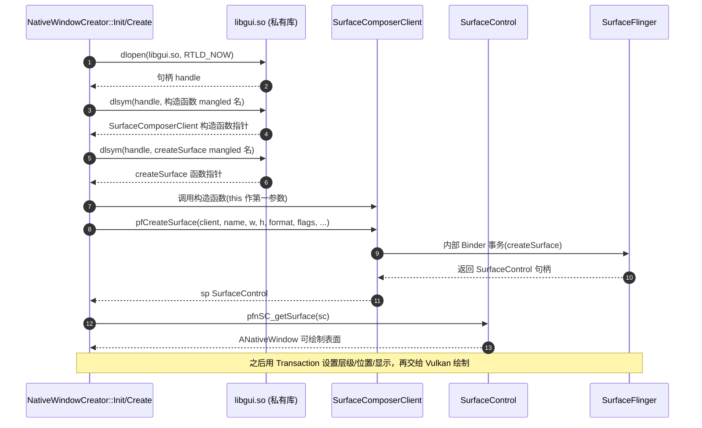

# 第 65 章 · dlsym libgui 创建窗口

> [!abstract] 本章目标
> 理解为什么不用 SDK 也能创建图层，以及 C++ 符号名（mangled name）是怎么回事。
> 这是 `ANativeWindowCreator.h` 的核心机制。

> [!note] 承上
> 上一章理解了"图层"。
> 本章动手**创建图层**——不用 SDK，靠 `dlsym` 调 SurfaceFlinger 的私有 API。

## 先看三条路的差别

| 方式 | 接口 | 限制 |
|---|---|---|
| Java `WindowManager` | SDK 公开 | 需 `SYSTEM_ALERT_WINDOW` 授权、Android 8+ 需用户手动开 |
| NDK `ANativeWindow` | 只能**用**窗口，不能**创建** | 窗口得由 Java 层给 |
| **`libgui` C++ 类** | 私有 API | root 权限，无授权弹窗 |

本项目选第三条。因为：
- 可执行文件里没有 Java 层
- 不想让用户看到"悬浮窗权限"授权弹窗
- root 下可以直接调

## libgui 里有什么

```bash
adb shell ls -l /system/lib64/libgui.so
nm -D /system/lib64/libgui.so | grep -i createSurface
```

你会看到一堆这样的符号：

```
_ZN7android21SurfaceComposerClient13createSurfaceERKNS_7String8EjjijPNS_2spINS_7IBinderEEENS_13LayerMetadataE
```

这串乱码叫 **mangled name（名字修饰）**。

## 为什么 C++ 符号是乱码

C 语言没有重载，函数名就是符号名：

```c
int add(int a, int b);        // 符号: add
```

C++ 支持重载和命名空间，所以要**把参数类型编码进符号名**：

```cpp
namespace android {
class SurfaceComposerClient {
    sp<SurfaceControl> createSurface(const String8& name, uint32_t w, uint32_t h,
                                     PixelFormat format, uint32_t flags,
                                     sp<IBinder>* parent, LayerMetadata metadata);
};
}
```

编码规则（Itanium ABI，ARM64 用这套）：

```
_ZN7android21SurfaceComposerClient13createSurfaceE...
   │  │      │                    │              │
   │  │      │                    │              └─ 参数类型
   │  │      │                    └─ 方法名（13 = 长度）
   │  │      └─ 类名（21 = 长度）
   │  └─ 命名空间（7 = android）
   └─ 前缀 _ZN ... E
```

拆解：

| 片段 | 含义 |
|---|---|
| `_ZN` | 嵌套符号开始 |
| `7android` | 长度 7 的 "android" |
| `21SurfaceComposerClient` | 长度 21 的类名 |
| `13createSurface` | 长度 13 的方法名 |
| `E` | 参数列表开始前的分隔 |
| `RKNS_7String8E` | `const String8&` |
| `j` | `uint32_t` |
| ... | 其余参数 |

> [!tip] 用 c++filt 解修饰
> ```bash
> aarch64-linux-android-c++filt _ZN7android21SurfaceComposerClient13createSurfaceE...
> ```
> 输出可读的 C++ 声明。排查符号问题时必用。

## 实际工作流程

> [!tip] 先看时序，再看代码
> 用 `dlsym` 调私有 C++ 符号创建图层的**完整调用链**（本项目 `ANativeWindowCreator` 走的就是这条）：



```
1. dlopen("libgui.so")                      打开库
2. dlsym(句柄, "mangled_name")              取函数地址
3. 强转成函数指针类型                         （要自己声明签名）
4. 调用                                      注意是 C 函数调用，没有 this
```

关键点：**C++ 成员函数编译后就是普通函数，第一个参数是 `this`**。

```cpp
// 原始 C++ 调用
client->createSurface(name, w, h, fmt, flags, &parent, meta);

// 等价的 C 调用（this 作为第一个参数）
pfCreateSurface(client, name, w, h, fmt, flags, &parent, meta);
```

## 需要自己声明的几个类

因为不能用系统头文件（NDK 没有），必须自己定义**内存布局兼容**的结构：

```cpp
// 精简版，只关心布局
namespace android {

// sp<T> 是 Android 的强指针，本质是一个指针 + 引用计数
template<typename T>
class sp {
public:
    sp() : m_ptr(nullptr) {}
    T* get() const { return m_ptr; }
    // ...
private:
    T* m_ptr;
};

class String8 {
public:
    String8(const char* s);   // 需要构造函数，也得 dlsym
    // 内部是 const char* 或 std::string（版本不同）
};

class SurfaceControl {
    // 不透明，只当句柄用
};

class SurfaceComposerClient {
public:
    void* vtbl;      // 虚表
    // ...
};

} // namespace android
```

> [!danger] 布局必须和系统版本一致
> `sp<T>` 在老版本是一个指针（8 字节），
> `String8` 在不同版本可能从 `char*` 变成 `std::string`（32 字节）。
> **布局错了，调用会崩溃或者静默出错。**
>
> 这是"用私有 API"最大的代价：
> 没有头文件保证，只能靠版本适配（第 66 章）。

## 函数指针类型声明

```cpp
typedef void* (*PFN_String8_ctor)(void*, const char*);

typedef void* (*PFN_createSurface)(
    void* thisptr,           // SurfaceComposerClient*
    void* name,              // const String8&
    uint32_t w,
    uint32_t h,
    int32_t  format,
    uint32_t flags,
    void*    parentHandle,   // sp<IBinder>* (out)
    void*    parent,         // sp<SurfaceControl>
    uint32_t windowType,
    uint32_t ownerUid,
    void*    outTransformHint,
    void*    metadata        // LayerMetadata*
);
```

## 完整骨架

```cpp
// 简化示意，省略错误处理
class NativeWindowCreator {
public:
    static bool Init() {
        if (libgui) return true;
        libgui = dlopen("libgui.so", RTLD_NOW);
        if (!libgui) return false;

        // 构造 SurfaceComposerClient（真实项目用 C2 构造，部分版本是 C1）
        pfnSCC_ctor = (PFN_SCC_ctor)dlsym(libgui, "_ZN7android21SurfaceComposerClientC2Ev");
        if (!pfnSCC_ctor)
            pfnSCC_ctor = (PFN_SCC_ctor)dlsym(libgui, "_ZN7android21SurfaceComposerClientC1Ev");
        // createSurface：符号随版本变（完整表见第 66 章），这里以 Android 14-16 为例
        pfnSCC_createSurface = (PFN_createSurface)dlsym(libgui,
            "_ZN7android21SurfaceComposerClient13createSurfaceERKNS_7String8EjjiiRKNS_2spINS_7IBinderEEENS_3gui13LayerMetadataEPj");
        pfnSC_getSurface = (PFN_getSurface)dlsym(libgui,
            "_ZNK7android14SurfaceControl10getSurfaceEv");
        if (!pfnSC_getSurface)
            pfnSC_getSurface = (PFN_getSurface)dlsym(libgui,
                "_ZN7android14SurfaceControl10getSurfaceEv");
        // ... 更多
        return pfnSCC_ctor && pfnSCC_createSurface;
    }

    static ANativeWindow* Create(const char* name, int w, int h) {
        // 1. new SurfaceComposerClient
        void* client = malloc(64);        // 大小要猜！见下
        pfnSCC_ctor(client);

        // 2. 检查连接是否成功
        if (pfnSCC_initCheck(client) != 0) return nullptr;

        // 3. 构造 String8 名字
        char nameBuf[sizeof(void*) * 4] = {};   // 布局依版本而定
        pfnString8_ctor(nameBuf, name);

        // 4. 创建 SurfaceControl
        void* sc = malloc(32);
        pfnSCC_createSurface(client, nameBuf, w, h,
                             PIXEL_FORMAT_RGBA_8888, 0,
                             nullptr, sc, 0, 0, nullptr, nullptr);
        if (!sc) return nullptr;

        // 5. 取 Surface（就是 ANativeWindow）
        void* surface = pfnSC_getSurface(sc);
        return (ANativeWindow*)surface;
    }
};
```

> [!warning] `malloc(64)` 是危险的猜测
> 上面用 `malloc` 分配对象是因为**没有头文件就不知道 sizeof**。
> 这是极端做法，本项目用了更稳妥的方式：
> 直接 `dlsym` 调用 `operator new` 或者按已知布局栈上分配。
>
> 实际工程里应该：
> 1. 从设备的 `libgui.so` 里确认结构体大小
> 2. 或者用 `dlsym` 拿全局的 `SurfaceComposerClient::getDefault()`（不需要 new）

## 获取显示信息

不需要创建窗口也能查屏幕：

```cpp
// 老接口（Android 10 之前）
typedef int32_t (*PFN_getDisplayInfo)(void* client, void* display, void* info);

// 新接口：getPhysicalDisplayIds + getDisplayInfo
typedef void (*PFN_getPhysicalDisplayIds)(void* client, void* outVector);
```

本项目 `ANativeWindowCreator::GetDisplayInfo()` 封装了这些，
返回宽、高、朝向。

## 三种可能的结果

| 结果 | 原因 | 处理 |
|---|---|---|
| 成功 | 布局、符号都对 | 正常 |
| `dlsym` 返回 null | 符号名不匹配（版本变了） | 换备选符号名（第 66 章） |
| 调用后崩溃 | 布局不匹配 / 参数顺序错 | 用 `dumpsys` + 反汇编核对 |

## 调试方法

```bash
# 1. 确认库里有这个符号
adb shell nm -D /system/lib64/libgui.so | grep createSurface

# 2. 解修饰看签名
adb shell cat /system/lib64/libgui.so > /tmp/libgui.so   # pull 出来
aarch64-linux-android-nm -D -C /tmp/libgui.so | grep createSurface

# 3. 看有几个重载（不同版本数量不同）
aarch64-linux-android-nm -D -C /tmp/libgui.so | grep -c 'createSurface'
```

## 运行轨迹透视

> [!tip] libgui 层用另一套日志宏：SURFACE_LOG_*（ANativeWindowCreator.h）
> 本项目有**两套日志体系**：
> - **driver.h**：`LS_LOGI_TAG`/`LS_LOGE_TAG`（内存驱动，卷六）
> - **ANativeWindowCreator.h**：`SURFACE_LOG_{ERROR,WARN,INFO,DEBUG,TRACE}`（图形层，本章）
> 后者是**五级 + 编译开关**，每级带固定前缀 `[-]`/`[!]`/`[+]`/`[*]`/`[=]`。

### 真实项目的日志宏（ANativeWindowCreator.h）

```cpp
// 五级日志宏，带统一前缀，可编译期整体关闭
#define SURFACE_LOG_ERROR(fmt, ...) \
    __android_log_print(ANDROID_LOG_ERROR, SURFACE_LOG_TAG, "[-] " fmt, ##__VA_ARGS__)
#define SURFACE_LOG_WARN(fmt, ...)  \
    __android_log_print(ANDROID_LOG_WARN,  SURFACE_LOG_TAG, "[!] " fmt, ##__VA_ARGS__)
#define SURFACE_LOG_INFO(fmt, ...)  \
    __android_log_print(ANDROID_LOG_INFO,  SURFACE_LOG_TAG, "[+] " fmt, ##__VA_ARGS__)
#define SURFACE_LOG_DEBUG(fmt, ...) \
    __android_log_print(ANDROID_LOG_DEBUG, SURFACE_LOG_TAG, "[*] " fmt, ##__VA_ARGS__)

// 符号解析失败时（真实项目 ResolveMethod 宏）
SURFACE_LOG_ERROR("Method not found: %s -> %s::%s", MethodSignature, #ClassName, #MethodName);

// 图层创建成功（真实项目）
SURFACE_LOG_INFO("ANativeWindow created successfully: %p", nativeWindow);

// 窗口尺寸（真实项目）
SURFACE_LOG_INFO("Mirror surface size: %d x %d", width, height);
```

### 成功路径的真实 logcat 输出

```bash
adb logcat -s AImGui:D *:S
```

```text
[+] ANativeWindow created successfully: 0x7a1c2e0000
[+] Mirror surface size: 1080 x 2400
[*] ZoomSurface called with scaleX: 1.000000, scaleY: 1.000000
```

### 失败路径的真实 logcat 输出
```text
[-] Method not found: _ZN7android21SurfaceComposerClient13createSurfaceE... -> SurfaceComposerClient::createSurface
[-] Failed to create surface: MirrorRoot@1
[-] Failed to get native window from surface control
[-] Unsupported system version: 4
```

> [!note] 关键观测点
> - **tag 是 `AImGui`**（`SURFACE_LOG_TAG`），与内存层的 `Driver` 区分；
> - **前缀一眼辨级**：`[-]`错误、`[!]`警告、`[+]`信息、`[*]`调试；
> - **编译期可整体关闭**：`SURFACE_LOG_ENABLE 0` 时所有宏变空（第 10 章宏开关）；
> - **符号解析失败带完整 mangled 名**——这是排查跨版本问题的关键线索（第 66 章）。

## 动手：符号侦察器

> [!important] 前置条件
> 需要 **root 设备**（能读 `/system/lib64/libgui.so`）。
> 侦察命令要在**设备 shell 或 `adb shell`** 里跑；无设备可跳过。

写一个程序，列出 libgui.so 里所有含关键字的符号：

```cpp
#include <dlfcn.h>
#include <cstdio>
#include <cstring>

int main(void) {
    void *lib = dlopen("libgui.so", RTLD_NOW);
    if (!lib) { printf("dlopen: %s\n", dlerror()); return 1; }
    printf("libgui.so 加载成功\n");

    // 尝试几个已知符号（真实项目 ANativeWindowCreator.h 里用的）
    const char *candidates[] = {
        "_ZN7android21SurfaceComposerClientC2Ev",           // 构造函数（项目用 C2）
        "_ZN7android21SurfaceComposerClientC1Ev",           // 构造函数（另一种，部分版本）
        "_ZNK7android14SurfaceControl10getSurfaceEv",       // getSurface（const 版）
        "_ZN7android14SurfaceControl10getSurfaceEv",        // getSurface（非 const 版）
        "_ZN7android13LayerMetadata8setInt32Eji",           // LayerMetadata::setInt32
        nullptr
    };

    for (int i = 0; candidates[i]; i++) {
        void *p = dlsym(lib, candidates[i]);
        printf("%-70s : %s\n", candidates[i], p ? "找到" : "未找到");
    }

    dlclose(lib);
    return 0;
}
```

在设备上跑，记录**你的 Android 版本下哪些符号存在**。
这份记录就是第 66 章做版本适配的依据。

## 动手验证清单

- [ ] **符号侦察**：`nm -D /system/lib64/libgui.so | grep createSurface` → 找到符号
- [ ] **看 mangled 名**：`c++filt <符号名>` → 还原成可读函数签名
- [ ] **dlopen libgui**：原生可执行文件里 `dlopen("libgui.so")` → 成功（App 里会失败）
- [ ] **dlsym 构造函数**：`dlsym(handle, "_ZN7android21SurfaceComposerClient...")` → 非 NULL
- [ ] **创建图层**：调用 createSurface → 拿到 SurfaceControl
- [ ] **验证顶层**：`dumpsys SurfaceFlinger` → 看到自己的图层名（伪装名）

> [!warning] 只能在原生可执行文件里做
> App（.so）在 Android 7+ 无法 dlopen libgui（linker namespace 限制），第 32 章讲过。

## 课后习题

### 习题 65.1 用 c++filt 还原符号名（★★，应用变式）

**任务要求**：拿本章的 mangled name，用工具还原成可读签名，并数一数参数个数。

**参考骨架**：

```bash
echo "_ZN7android21SurfaceComposerClient13createSurfaceERKNS_7String8EjjijPNS_2spINS_7IBinderEEENS_13LayerMetadataE" \
  | $NDK/toolchains/llvm/prebuilt/windows-x86_64/bin/llvm-cxxfilt
# android::SurfaceComposerClient::createSurface(android::String8 const&, unsigned int, unsigned int, int, unsigned int, android::sp<android::IBinder>*, android::LayerMetadata)
```

**验证断言**：能数出 7 个参数，并说出 `RK`、`j`、`PNS_` 各代表什么类型。

### 习题 65.2 分析"C++ 符号为什么必须修饰"（★★★，分析）

**任务要求**：分析：

1. C 为什么不需要名字修饰？C++ 为什么需要？
2. 如果两个重载函数 `f(int)` 和 `f(double)` 不修饰，会怎样？
3. 这对 `dlsym` 有什么影响？

**参考答案要点**：
1. C 无重载、无命名空间，函数名唯一；C++ 有重载/命名空间/模板，必须把**参数类型、命名空间**编码进符号名才能区分；
2. 两个 `f` 会**符号冲突**，链接器无法区分，只能报重复定义；
3. `dlsym` 必须用**修饰后的完整符号名**（mangled），不能只写 `createSurface`。

> [!tip] 评价层要点
> 名字修饰不是"乱码"，而是**把类型信息编码进符号**的必然结果。
> 理解它，才能读懂 `dlsym` 时的那些"长串符号"。

## 本章小结

> [!abstract] 本章要点已收束
> 回头把本页的"动手"与结论串成一句话；有勾不上的验收项，回去补做。

## 验收清单

- [ ] 知道三条创建图层路径的差别（Java/NDK/dlsym libgui，各说一句）
- [ ] 理解 mangled name 的编码规则（`_ZN` + 长度 + 名字）（手动解一个 _ZN 符号）
- [ ] 会用 `c++filt` 解修饰（对 _ZN 符号跑 c++filt，得到可读签名）
- [ ] 知道 C++ 成员函数编译后第一个参数是 `this`（说出调用时需传对象指针）
- [ ] 知道用私有库的最大代价是"结构体布局没有头文件保证"（说出 String8 跨版本变化）
- [ ] 会写符号侦察器，确认设备上有哪些符号（运行程序，列出设备含某符号）

→ 下一章：[[第66章-跨版本符号适配]]　—— 学会"一套代码适配 Android 5~17"的方法。
