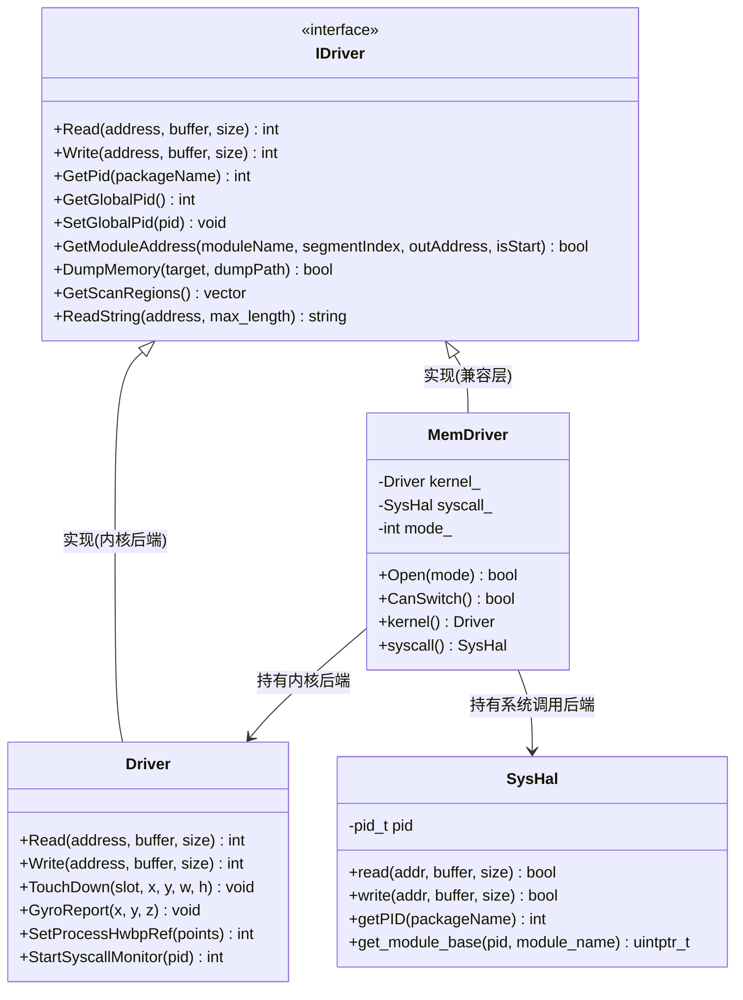

# 第 80 章 · 设计驱动抽象层 IDriver

> [!abstract] 本章目标
> 学会用抽象接口隔离"后端实现"，让业务代码不关心数据从哪来。
> 这是本项目架构上最漂亮的一处设计。

> [!note] 承上
> 卷六到现在有两条路：内核驱动 + 系统调用。
> 本章用**抽象层 `IDriver`** 把它们统一——业务代码不关心数据从哪来。本项目最漂亮的架构设计。

> [!important] 前置条件
> - 本章是**纯 C++ 设计模式**，可在**任意平台本机编译验证**（用假的 `MemDriver`），无需设备。

## 先看没有抽象层会怎样

业务代码直接调内核驱动：

```cpp
uint64_t Uworld = kernel_driver->Read<uint64_t>(base + 0xB3EC650);
```

问题来了：用户没装内核驱动怎么办？
要么程序不能跑，要么每个调用点都写 `if/else`：

```cpp
uint64_t Uworld;
if (useKernel) Uworld = kernel_driver->Read<uint64_t>(...);
else           Uworld = syscall_read<uint64_t>(...);
```

几百处调用点，每处都写一遍——**不可维护**。

## 解法：面向接口编程

```
业务代码  ──→  IDriver（接口）  ←──  Driver（内核后端）
                   ↑
                   └──────────────  MemDriver → SysHal（系统调用后端）
```

业务代码只认 `IDriver*`，运行时指向哪个后端由配置决定。

## 坏味道重构推演：从稚嫩到优雅

> [!tip] 为什么要看「稚嫩写法」
> 理解设计模式最快的方式，是先看**没有它时**会写成什么样。
> 下面从「初学者直觉写法」演进到「本项目的真实架构」，你会明白 `IDriver` 每一处设计的来由。

### ❌ 稚嫩写法：硬编码 + if/else 分支

初学者最常见的写法——所有逻辑塞进一个函数，用 `if/else` 区分后端：

```cpp
// ❌ 坏味道：业务逻辑与后端实现耦合，每处调用点都要判后端
class MemoryTool {
    bool useKernel;          // 硬编码选择方式
    Driver* kernelDriver;    // 直接依赖具体类型
    SysHal* syscallDriver;

public:
    uint64_t ReadUWorld(uint64_t base) {
        if (useKernel) {
            return kernelDriver->Read<uint64_t>(base + 0xB3EC650);
        } else {
            return syscallDriver->read<uint64_t>(base + 0xB3EC650);
        }
    }
    Vec3 ReadPosition(uint64_t obj) {
        if (useKernel) {                       // ← 每个方法都重复这段 if/else
            return kernelDriver->Read<Vec3>(obj + 0x1F0);
        } else {
            return syscallDriver->read<Vec3>(obj + 0x1F0);
        }
    }
    // ... 几十个方法，每个都复制一遍 if/else
};
```

**坏味道清单**：

| 坏味道 | 表现 | 后果 |
|---|---|---|
| 硬编码分支 | 每个方法都写 `if (useKernel)` | 加第三个后端要改**每一处** |
| 重复代码 | `if/else` 块在几十个方法里复制 | 改一处漏一处 |
| 依赖具体类 | 成员是 `Driver*`/`SysHal*` | 无法替换、无法 mock 测试 |
| 职责过载 | 业务逻辑和传输逻辑混在一个类 | 单测要真机+root 才能跑 |

### ✅ 优雅写法：本项目真实架构

本项目把这些关注点**拆开**（`driver.h` / `MemDriver.h`）：

```cpp
// ✅ 优雅：业务只依赖抽象 IDriver（本项目真实定义）
class IDriver {
public:
    virtual int Read(uint64_t address, void *buffer, size_t size) = 0;
    virtual int Write(uint64_t address, void *buffer, size_t size) = 0;
    virtual int GetPid(std::string_view packageName) = 0;
    // ... 纯虚接口
};

// 业务代码：只认 IDriver*，一行都不关心后端是谁
IDriver *dr = &g_driver;              // 全局唯一入口（draw_Gui.cpp）
uint64_t Uworld = dr->Read<uint64_t>(base + 0xB3EC650);   // 换个后端，这行不变
```

本项目的 `MemDriver` 是**转发器**——内部持有 `Driver*` 或 `SysHal*`，把调用转过去：

```cpp
// ✅ MemDriver 内部按已选模式转发（真实项目 MemDriver.h）
class MemDriver : public IDriver {
    Driver *kernel_  = nullptr;
    SysHal *syscall_ = nullptr;
public:
    int Read(uint64_t address, void *buffer, size_t size) override {
        if (syscall_ != nullptr) {
            return syscall_->read((uintptr_t)address, buffer, size) ? (int)size : -EIO;
        }
        if (kernel_ != nullptr) return kernel_->Read(address, buffer, size);
        return -EIO;
    }
};
```

### 核心指标对比

| 维度 | ❌ 稚嫩写法 | ✅ 本项目架构 |
|---|---|---|
| **可维护性** | 加后端改 N 处 | 加后端改 1 处（新增派生类） |
| **可扩展性** | 硬编码 `bool useKernel`，最多 2 种 | 开闭原则，后端数量无上限 |
| **单元测试便利度** | 必须真机 + root | 注入 `FakeDriver` 即可本机测 |
| **代码重复** | 每个方法复制 `if/else` | 零重复，只在虚函数表分发 |
| **依赖方向** | 业务 → 具体实现（倒挂） | 业务 → 抽象 ← 实现（倒置） |

### 演进动因剖析

> [!note] 为什么本项目最终采用 IDriver？
> 1. **双后端是硬需求**：内核驱动快但要装驱动，系统调用无需驱动但慢——
>    **两条路都必须支持**，且要运行时切换（`syscall驱动` 配置项）。
> 2. **调用点极多**：`dr->Read` 遍布 `Draw_ESP` / `SilentAim` / `pXthread`，
>    若每处都判后端，维护成本爆炸。
> 3. **虚函数开销可忽略**：源码注释写明「每次接口内部都是几十微秒的驱动 I/O，
>    虚函数那几纳秒开销完全可忽略」——**性能不构成反对理由**。
> 4. **可测试性**：抽出 `IDriver` 后，能注入 `FakeDriver` 在本机验证业务逻辑（见课后习题 80.1）。
>
> **一句话**：当「多个可替换实现」+「大量调用点」+「需要测试」三者同时出现时，
> 面向接口编程就是必然选择——这正是本项目采用它的原因。

## 本项目的接口定义

> [!tip] 先看图，再看代码
> 本项目「两个后端二选一」的类结构。**业务代码只依赖 `IDriver` 接口**，
> 运行时由 `MemDriver` 转发到 `Driver`（内核）或 `SysHal`（系统调用）：



```cpp
class IDriver {
public:
    virtual ~IDriver() = default;

    // 内存读写（两个后端都支持）
    virtual int  Read(uint64_t address, void *buffer, size_t size) = 0;
    virtual int  Write(uint64_t address, void *buffer, size_t size) = 0;

    // 进程与模块
    virtual int  GetPid(std::string_view packageName) = 0;
    virtual int  GetGlobalPid() = 0;
    virtual void SetGlobalPid(int pid) = 0;
    virtual bool GetModuleAddress(std::string_view moduleName, short segmentIndex,
                                  uint64_t *outAddress, bool isStart) = 0;

    // 内核驱动专属（系统调用后端给安全默认值）
    virtual bool DumpMemory(std::string_view target, std::string *dumpPath = nullptr) = 0;
    virtual std::vector<std::pair<uintptr_t, uintptr_t>> GetScanRegions() = 0;

    // ---- 以下是非虚的便捷封装，所有后端共享 ----
    template <typename T> T Read(uint64_t address) {
        T value = {};
        if (Read(address, &value, sizeof(T)) <= 0) value = T{};
        return value;
    }

    template <typename T> int Write(uint64_t address, const T &value) {
        return Write(address, const_cast<T*>(&value), sizeof(T));
    }

    std::string ReadString(uint64_t address, size_t max_length = 128) {
        if (!address) return "";
        std::vector<char> buffer(max_length + 1, 0);
        if (Read(address, buffer.data(), max_length) > 0) {
            buffer[max_length] = '\0';
            return std::string(buffer.data());
        }
        return "";
    }
};
```

> [!note] 模板方法定义在基类里，非虚
> `Read<T>` 依赖虚函数 `Read(addr, buf, size)` 实现，
> 所以**所有后端自动获得**模板和字符串功能，不用各写一遍。
>
> 这是"模板方法模式"的经典应用。

## 虚函数开销有多大？

一次虚调用 = 一次间接跳转（查虚表 + 跳）：

```
直接调用:  ~2 周期
虚调用:    ~5-10 周期（多一次内存访问）
```

听起来有差别，但对比实际的驱动 I/O（几千周期）：

```
虚调用开销 10 周期 vs 驱动 I/O 5000 周期 = 0.2%
```

**完全可以忽略。** 源码注释里也写了这个理由：

> 只有这几个接口会走虚函数转发，每个接口内部都是一次真正的驱动 I/O（几十微秒级），
> 虚函数开销可以忽略。

## 后端一：Driver（内核）

```cpp
class Driver : public IDriver {
public:
    int Read(uint64_t address, void *buffer, size_t size) override {
        return HandleVirtualMemoryRWEvent(request_op_vmem_read, address, buffer, size);
    }
    int Write(uint64_t address, void *buffer, size_t size) override {
        return HandleVirtualMemoryRWEvent(request_op_vmem_write, address, buffer, size);
    }
    // ...

    // 内核专属能力（非 IDriver 接口，直接调用）
    void TouchDown(int slot, int x, int y, int w, int h);
    void GyroReport(int x, int y, int z);
    int  SetProcessHwbpRef(std::span<const bp_point> points);
    int  StartSyscallMonitor(int pid);
    // ...
};
```

**注意**：触摸、陀螺仪、断点这些**不在 `IDriver` 里**，
因为系统调用后端提供不了。它们通过 `Driver*` 具体类型直接访问。

## 后端二：MemDriver（包装 SysHal）

```cpp
class MemDriver : public IDriver {
public:
    bool Open(int mode) {
        if (kernel_ != nullptr || syscall_ != nullptr) return ok_;   // 已打开，不能切

        mode_ = mode;
        ok_ = (mode == MEM_DRIVER_SYSCALL) ? OpenSyscall() : OpenKernel();
        return ok_;
    }

    int Read(uint64_t address, void *buffer, size_t size) override {
        if (buffer == nullptr || size == 0) return -EINVAL;
        if (syscall_ != nullptr) {
            return syscall_->read((uintptr_t)address, buffer, size)
                 ? (int)size : -EIO;
        }
        if (kernel_ != nullptr) return kernel_->Read(address, buffer, size);
        return -EIO;
    }
    // ...

    // 调试用：拿到内部的具体后端
    Driver *kernel()  { return kernel_; }
    SysHal *syscall() { return syscall_; }

private:
    Driver *kernel_  = nullptr;
    SysHal *syscall_ = nullptr;
    int     mode_    = MEM_DRIVER_KERNEL;
    bool    ok_      = false;
    int     global_pid_ = 0;
    const char *error_ = "";
};
```

`MemDriver` 是个**转发器**：内部持有两个具体后端之一，把调用转过去。

## 为什么"打开后不能切换"

```cpp
bool Open(int mode) {
    if (kernel_ != nullptr || syscall_ != nullptr) return ok_;
    ...
}
bool CanSwitch() const { return kernel_ == nullptr && syscall_ == nullptr; }
```

源码里的解释：

> 后端一旦打开就不再切换：内核驱动握手成功后不能安全释放
> （用户态退出但内核侧仍在轮询，会空转），所以必须先选好模式再点初始化。

**这不是偷懒，是安全性考虑**：内核线程还在轮询共享内存，
用户态把内存释放了，内核就会访问已释放的地址 → 崩溃。

UI 上也体现了这个约束：

```cpp
ImGui::BeginDisabled(!g_driver.CanSwitch());
if (ImGui::Combo("驱动选择", &driverIdx, "lsdriver\0syscall\0")) { ... }
ImGui::EndDisabled();
```

启动后下拉框变灰，不可改。

## 全局入口

```cpp
// draw_Gui.cpp
static MemDriver g_driver;
IDriver *dr = &g_driver;

// driver.h
extern IDriver *dr;
```

全项目只有一个 `dr` 指针，业务代码到处用它：

```cpp
dr->Read<uint64_t>(addr);
dr->GetPid("...");
```

> [!danger] 【安全最佳实践】GetPid 的实现不能用字符串拼接执行命令
> **威胁机制（命令注入）**：本项目的系统调用后端 `SysHal::getPID` 若这样实现——
> ```c
> char cmd[0x100] = "pidof ";
> strcat(cmd, PackageName);      // ⚠️ 把外部输入直接拼进命令
> popen(cmd, "r");               // ⚠️ 交给 shell 执行
> ```
> 一旦 `PackageName` 来自不可信来源（配置文件、网络、用户输入），
> 攻击者可传入 `com.x; rm -rf /data` 之类，**shell 会执行分号后的任意命令**。
>
> **规避原则**：
> - **包名必须白名单校验**（只允许 `[A-Za-z0-9._]`），拒绝含 `; & | $ 空白` 等元字符的输入；
> - 更稳的做法是**不用 shell**：直接遍历 `/proc/<pid>/cmdline` 匹配包名（本项目内核驱动的 `GetPid` 就是遍历实现，无注入面）；
> - 若必须调外部命令，用 `execve` 传参数数组，绕开 shell 解析。
>
> ```c
> // ✅ 安全写法：遍历 /proc 匹配，不经 shell
> for each pid in /proc:
>     read /proc/<pid>/cmdline;
>     if (cmdline == packageName) return pid;   // 精确匹配，无注入
> ```

## 专属能力怎么访问

内核专属功能需要拿到具体类型：

```cpp
// 初始化时
TouchAim::g_kernel = g_driver.kernel();      // nullptr 表示无内核
PovAim::g_kernel   = g_driver.kernel();

// 使用时
if (TouchAim::g_kernel == nullptr) {
    // 无内核，功能不可用
} else {
    TouchAim::g_kernel->TouchDown(slot, x, y, w, h);
}
```

UI 上会提示：

```cpp
if (TouchAim::g_kernel == nullptr)
    ImGui::TextColored(ImVec4(1.0f, 0.3f, 0.3f, 1.0f), "无内核驱动!");
else
    ImGui::TextColored(ImVec4(0.3f, 1.0f, 0.3f, 1.0f), "内核已就绪");
```

**这就是"能力探测"模式**：不是所有后端都支持所有功能，使用前先问。

## 设计原则总结

| 原则 | 本项目的体现 |
|---|---|
| 依赖倒置 | 业务依赖抽象 `IDriver`，不依赖具体后端 |
| 单一职责 | `Driver` 只管内核通信，`SysHal` 只管系统调用 |
| 开闭原则 | 加新后端（如 ptrace）不用改业务代码 |
| 能力探测 | 专属功能通过 `kernel()` 取值 + 判空 |
| 失败降级 | 无内核时给出安全默认值，不崩溃 |

## 动手：加第三个后端

练习：实现一个 `PtraceDriver`（用 ptrace 读写），接入抽象层。

```cpp
class PtraceDriver : public IDriver {
public:
    ~PtraceDriver() { if (attached_) ptrace(PTRACE_DETACH, pid_, 0, 0); }

    int Read(uint64_t addr, void *buf, size_t size) override {
        // ptrace 一次只能读一个字，要循环
        uint8_t *p = (uint8_t*)buf;
        for (size_t i = 0; i + 8 <= size; i += 8) {
            long v = ptrace(PTRACE_PEEKDATA, pid_, (void*)(addr + i), 0);
            if (errno) return -EIO;
            memcpy(p + i, &v, 8);
        }
        // 处理尾部不足 8 字节
        return (int)size;
    }
    // ...其它接口
private:
    pid_t pid_ = 0;
    bool attached_ = false;
};
```

然后在 `MemDriver` 里加一个分支。你会发现：**业务代码一行都不用改**。

这就是抽象层的价值——亲手加一次体会最深。

## 课后习题

### 习题 80.1 用接口 + 多态实现可切换后端（★★）

**任务要求**：定义抽象接口 `IDriver`（`read` 纯虚），实现两个后端 `MemDriver` 和 `FakeDriver`，
业务函数只认 `IDriver*`，验证切换后端时业务代码**零改动**。

**参考实现**：

```cpp
#include <cstdio>
#include <cstring>
#include <memory>
#include <cassert>
#include <cstdint>

class IDriver {
public:
    virtual ~IDriver() = default;
    virtual int Read(uint64_t addr, void* buf, size_t size) = 0;
    template <typename T> T Read(uint64_t addr) {
        T v{};
        if (Read(addr, &v, sizeof(T)) <= 0) v = T{};
        return v;
    }
};

// 后端 1：真实内存
class MemDriver : public IDriver {
    const uint8_t* base_;
public:
    explicit MemDriver(const uint8_t* b) : base_(b) {}
    int Read(uint64_t addr, void* buf, size_t size) override {
        memcpy(buf, base_ + addr, size);
        return (int)size;
    }
};

// 后端 2：假数据（用于测试）
class FakeDriver : public IDriver {
public:
    int Read(uint64_t, void* buf, size_t size) override {
        memset(buf, 0xAB, size);   // 总是返回 0xAB
        return (int)size;
    }
};

// 业务函数：只认 IDriver*
int business_read_hp(IDriver* dr) {
    return dr->Read<int>(0);   // 读偏移 0 处的 int
}

int main() {
    uint8_t mem[16] = {0};
    int hp = 1234;
    memcpy(mem, &hp, 4);

    MemDriver  real(mem);
    FakeDriver fake;
    IDriver* drivers[2] = { &real, &fake };

    assert(business_read_hp(drivers[0]) == 1234);      // 真实后端
    assert(business_read_hp(drivers[1]) == 0xABABABAB); // 假后端（同一业务代码）
    printf("真实后端 hp=%d  假后端 hp=0x%X\n",
           business_read_hp(drivers[0]), business_read_hp(drivers[1]));
    printf("习题 80.1 全部通过（业务代码零改动）\n");
    return 0;
}
```

**验证断言**：同一个 `business_read_hp`，传 `MemDriver` 得 `1234`，传 `FakeDriver` 得 `0xABABABAB`——
**业务代码一行没改**。

> [!tip] 这道题练什么
> ① **面向接口编程**——业务只依赖 `IDriver*`，不关心背后是谁；
> ② **多态分发**——虚函数表在运行时选对实现；
> ③ 这正是本项目 `dr` 能是 `Driver` 或 `MemDriver` 的原理（第 80 章核心）。

## 运行轨迹透视

> [!tip] 切换后端时，日志能证明「确实走了不同的路」
> IDriver 抽象后，业务代码不变，但底层日志会显示当前用的是哪个后端。

### 两种后端的日志差异

```cpp
// 内核驱动后端（Driver）：日志 tag 是 Driver，含共享内存握手
LS_LOGI_TAG("Driver", "驱动已经连接");

// 系统调用后端（SysHal）：无握手日志（不走共享内存）
// process_vm_readv 是静默的系统调用，成功时不产生日志
```

### 成功路径（内核后端）

```text
I/Driver  ( 8123): 分配虚拟地址成功: 地址=0x2025827000 大小=4144
I/Driver  ( 8123): 驱动已经连接
```

### 失败路径（GUI 显示后端选择结果）

```cpp
// 本项目 GUI 里显示当前后端与错误（真实项目做法）
__android_log_print(ANDROID_LOG_ERROR, "Driver", "初始化失败: %s (%s)",
                    g_driver.CurrentModeName(), g_driver.LastError());
```

```text
# 内核后端失败（无驱动）
E/Driver  ( 8123): 初始化失败: 内核驱动 (内核驱动对象创建失败)

# 系统调用后端（无握手日志，直接可用）
# 仅当读写失败时才出现错误
E/Driver  ( 8123): 初始化失败: 系统调用 (系统调用后端创建失败)
```

> [!note] 抽象层的可观测性要点
> - **`CurrentModeName()` 提供当前后端名**——日志里能直接看出用的是哪种驱动；
> - **`LastError()` 提供失败原因**——不必去猜，日志直接给出；
> - **业务代码无需关心后端**，但日志层暴露了后端差异，方便排查「为什么这台设备不行」。

## 常见坑排查表

| 症状 | 最可能的原因 | 解法 |
|---|---|---|
| 调用 `dr->Read` 崩溃 | `dr` 是空指针 | 初始化时判空；用假后端测试 |
| 切换后端后行为不一致 | 两个后端接口没对齐 | 纯虚函数保证签名一致 |
| 编译报"抽象类不能实例化" | 派生类漏实现纯虚函数 | 实现所有 `= 0` 的函数 |
| 虚函数调用没生效 | 用了值传递（切片）| 用指针或引用传递 `IDriver*` |

## 动手演练：真实功能扩展 —— 新增第三个数据源适配器

### 【业务需求场景描述】

项目现在有两种后端（`Driver` 内核 / `MemDriver` 系统调用）。假设你要接入一个**通过网络转发**的第三后端（把读写请求发给另一台设备处理）。得益于 `IDriver` 抽象，**业务代码一行都不用改**。

### 【修改或扩展的文件列表提示】

| 文件 | 操作 |
|---|---|
| `include/My_Utils/SocketDriver.h` | **新建**：继承 `IDriver`，实现 6 个纯虚函数 |
| `main.cpp` | 修改：按配置实例化 `SocketDriver` 而非 `MemDriver` |
| `include/My_Utils/MemDriver.h` | 参考：照它的转发模式写 |

### 【扩展接口契约骨架代码】

```cpp
// SocketDriver.h —— 第三个后端（网络转发）
#pragma once
#include "driver.h"     // IDriver

class SocketDriver : public IDriver {
public:
    // TODO 1: 构造函数里建立 socket 连接

    // 必须实现的 6 个纯虚函数：
    int  Read(uint64_t address, void *buffer, size_t size) override;
    int  Write(uint64_t address, void *buffer, size_t size) override;
    int  GetPid(std::string_view packageName) override;
    int  GetGlobalPid() override;
    void SetGlobalPid(int pid) override;
    bool GetModuleAddress(std::string_view moduleName, short segmentIndex,
                          uint64_t *outAddress, bool isStart) override;

    // 内核独有能力：安全默认值
    bool DumpMemory(std::string_view target, std::string *dumpPath = nullptr) override { return false; }
    std::vector<std::pair<uintptr_t, uintptr_t>> GetScanRegions() override { return {}; }
private:
    int sock_ = -1;
    int globalPid_ = 0;
};
```

### 【自测验证断言与验收标准】

```cpp
// 验证：业务代码零改动
IDriver* dr = new SocketDriver();   // 只换这一处
uint64_t hp = dr->Read<uint64_t>(base + 0x370);  // 调用方式完全一样
assert(dr->GetGlobalPid() == 期望的 pid);
```

| 验收项 | 标准 |
|---|---|
| 6 个纯虚函数全部实现 | 编译通过（无"抽象类不能实例化"）|
| `draw_Gui.cpp` **一行未改** | 用 `diff` 确认 |
| 读写语义一致 | 同地址读出的值与 `MemDriver` 一致 |
| 内核独有能力返回安全值 | 调 `DumpMemory` 返回 false 不崩 |

## 本章小结

> [!abstract] 本章要点已收束
> 回头把本页的"动手"与结论串成一句话；有勾不上的验收项，回去补做。

## 验收清单

- [ ] 理解"面向接口编程"解决的问题（说出"业务代码不依赖具体后端"）
- [ ] 知道 `IDriver` 哪些方法是虚的、哪些不是（为什么）（说出模板方法非虚的原因）
- [ ] 知道虚函数开销相对驱动 I/O 可以忽略（说出"I/O 几十微秒，虚函数几纳秒"）
- [ ] 理解为什么"打开后不能切换后端"（说出"内核连接无法安全释放"）
- [ ] 理解"能力探测"模式（`kernel()` 判空）（说出怎么判断后端能力）
- [ ] 知道本项目全局只有一个 `dr` 指针（说出为什么全局唯一）
- [ ] 实现了第三个后端，验证了业务代码不用改 ★（加 ptrace 后端，业务代码零改动）

→ 下一章：[[第81章-批量读与缓存]]　—— 把每帧几千次 I/O 压到几十次。
