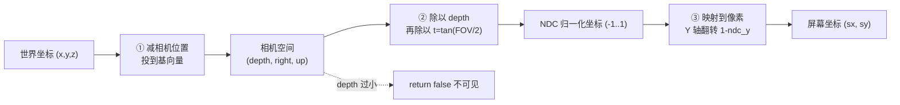

# 第 51 章 · 世界坐标转屏幕坐标

> [!abstract] 本章目标
> 完成总纲承诺的第 5 个成果：**`w2s_demo`**——
> 一个能在电脑上离线验证 W2S 完整链路的程序。

> [!note] 本章的数学用内联实现
> 本章 W2S 依赖的向量/矩阵运算**直接内联写出**（`g_matrix[16]` + 几个函数），
> 便于单文件运行、快速验证。
> **第 53 章会把它们沉淀成可复用的 `mathlib` 库**——到时你会看到：
> 本章的内联代码，就是 `mathlib` 里 `Camera::BuildMatrix` / `WorldToScreen` 的雏形。

> [!note] 承上
> 第 49 章（视图矩阵）+ 第 50 章（投影矩阵）是两块积木。
> 本章把它们拼起来，完成**从世界坐标到屏幕坐标的完整链路**（总纲承诺的第 5 个成果 `w2s_demo`）。

## 先看成品能做什么

```
$ ./w2s_demo
相机: 位置(0,0,0) 朝向(P=0,Y=0) FOV=90  屏幕 2160x2400 (半 1080x1200)

[1] 正前方 100m      → (1080.0, 1200.0)   屏幕中心 ✓
[2] 右前 (100,50,0)  → (1620.0, 1200.0)   偏右 ✓
[3] 上方 (100,0,50)  → (1080.0,  600.0)   偏上 ✓
[4] 后方 (-100,0,0)  → 不可见 ✓
[5] 距离 200m 同角度 → 偏移减半 ✓
```

这个程序跑通了，你就掌握了整个 ESP 的数学核心。

## 完整链路回顾

> [!tip] W2S 三步一张图
> 从「世界坐标」到「屏幕像素」，中间要穿过三个空间。
> 下图是本项目 `WorldToScreen` 的核心变换链（对应第 49、50 章）：



```
世界坐标 (x,y,z)
    │
    │  ① 减相机位置、投到基向量  →  相机空间
    ↓
相机空间 (depth, right, up)
    │
    │  ② 除以 depth、除以 t      →  归一化坐标
    ↓
NDC (-1..1)   ← 归一化设备坐标（Normalized Device Coordinates）
    │
    │  ③ 映射到像素、翻转 Y
    ↓
屏幕坐标 (sx, sy)
```

三个步骤，对应第 49、50 章的内容。

## 本项目的实现

> [!note] 这是**项目源码摘录**，不能单独编译
> 下面这段用了项目里真实的 `Vector3A`、`ConfigManager::Settings`、`matrix`、`px/py`——
> 这些本卷都没有定义，**复制去编译一定报错**。
> 它的作用是"让你看看真实项目里这段长什么样"。
> 想动手运行，请用本章后面 [[#完整实现 w2s_demo]] 那块（自包含、可编译）。

```cpp
inline bool WorldToScreen(const Vector3A& obj, Vector2A& screen) {
    // 分支 A：用引擎矩阵
    if (ConfigManager::Settings.矩阵W2S && MatrixPtr != 0) {
        const float* m = &MatrixData.M[0][0];
        const float w = m[3]*obj.X + m[7]*obj.Y + m[11]*obj.Z + m[15];
        if (w < 0.001f) return false;
        const float cx = m[0]*obj.X + m[4]*obj.Y + m[8] *obj.Z + m[12];
        const float cy = m[1]*obj.X + m[5]*obj.Y + m[9] *obj.Z + m[13];
        screen.X = (cx / w + 1.0f) * px;
        screen.Y = (1.0f - cy / w) * py;
        return std::isfinite(screen.X) && std::isfinite(screen.Y);
    }

    // 分支 B：自算矩阵
    float w = matrix[3]*obj.X + matrix[7]*obj.Y + matrix[11]*obj.Z + matrix[15];
    if (w < 0.001f) return false;

    float clip_x = matrix[0]*obj.X + matrix[4]*obj.Y + matrix[8]*obj.Z + matrix[12];
    float clip_y = matrix[1]*obj.X + matrix[5]*obj.Y + matrix[9]*obj.Z + matrix[13];

    screen.X = (clip_x / w * 水平焦距系数 + 1.0f) * px;
    screen.Y = (1.0f - clip_y / w * 垂直焦距系数) * py;
    return true;
}
```

两个分支结构相同，只是矩阵来源不同。

## 另一套封装（GameTools）

```cpp
void WorldToScreen(Vec2 *bscreen, Vec3 *obj) {
    Vector2A s;
    if (::WorldToScreen(Vector3A(obj->x, obj->y, obj->z), s)) {
        bscreen->x = s.X;
        bscreen->y = s.Y;
    } else {
        bscreen->x = NAN;
        bscreen->y = NAN;      // ★ 失败时填 NAN
    }
}
```

> [!note] 失败用 NAN 而不是 0
> 如果用 0，调用方分不清"真的在左上角"和"投影失败"。
> NAN 会传染——任何算术都得到 NAN，最终被 `IsFiniteScreenPoint` 拦住。
> 这是**故意的设计**：让错误自己暴露出来，而不是悄悄画错。

本项目调用方：

```cpp
Vector2A s;
pt[k].screen = WorldToScreen(w, s) ? s : Vector2A(NAN, NAN);
...
if (finite(a.screen) && finite(b.screen)) {
    draw->AddLine(...);       // 只有两端都有效才画
}
```

## 屏幕外判定

投影成功不代表在屏幕内。物体可能在相机后方（已被 w<0.001 拦掉），
也可能在视野外（投影到屏幕坐标之外）：

```cpp
bool IsOnScreen(const Vector2A &p) {
    return p.X >= 0 && p.X <= abs_ScreenX &&
           p.Y >= 0 && p.Y <= abs_ScreenY;
}
```

本项目画方框时的检查：

```cpp
if (!std::isfinite(boxWidth) || boxWidth <= 1.0f ||
    boxWidth > static_cast<float>(abs_ScreenX) ||     // 太宽，异常
    boxRight < 0.0f || boxX > abs_ScreenX ||          // 完全在左右外
    boxBottom < 0.0f || boxTop > abs_ScreenY) {       // 完全在上下外
    continue;
}
```

这是**包围盒剔除**：完全在屏幕外就跳过，省掉绘制开销。

## 三个典型错误与症状

| 错误 | 症状 | 原因 |
|---|---|---|
| 忘记翻转 Y | 画面上下颠倒 | 少了 `1 - ndc` |
| 忘了透视除法 | 远近一样大 | 少了 `/ w` |
| px/py 用成全屏尺寸 | 方框在右下角、偏移一半 | 应该用**半宽半高** |

第三个特别常见。本项目：

```cpp
GameTools::ScreenSize.x = abs_ScreenX / 2;    // ← 除 2！
GameTools::ScreenSize.y = abs_ScreenY / 2;
```

> [!danger] 这个"半宽"设计引发过一个 bug
> 附录 U 的 S4 缺陷提过：`TouchAim::ScreenSize()` 返回的是半宽半高，
> 但被当成全屏尺寸传给触摸接口做归一化 → 触摸坐标全错。
> **同一个变量，两处语义**——这是设计上的隐患。
> 你自己写时，建议用两个明确命名的变量：`ScreenHalfW/H` 和 `ScreenW/H`。

## 完整实现 w2s_demo

```cpp
// w2s_demo.c —— 可离线运行的完整 W2S 验证程序
#include <stdio.h>
#include <math.h>
#include <stdbool.h>

#define PI 3.14159265358979323846

typedef struct { float x, y, z; } Vec3;
typedef struct { float Pitch, Yaw, Roll; } Rotator;

static float g_matrix[16];
static float g_px = 0, g_py = 0;      // 屏幕半宽半高
static float g_kx = 1.0f, g_ky = 1.0f; // 焦距微调

void cam_make_matrix(Vec3 loc, Rotator rot, float fovDeg) {
    if (fovDeg < 1.0f || fovDeg > 179.0f) return;
    if (loc.x == 0 && loc.y == 0 && loc.z == 0) return;

    float pitch = rot.Pitch * PI / 180.0f;
    float yaw   = rot.Yaw   * PI / 180.0f;
    float sp = sinf(pitch), cp = cosf(pitch);
    float sy = sinf(yaw),   cy = cosf(yaw);
    float t  = tanf(fovDeg * 0.5f * PI / 180.0f);
    if (t == 0.0f) t = 0.0001f;

    /* 深度行（forward） */
    g_matrix[3]  = cy*cp;
    g_matrix[7]  = sy*cp;
    g_matrix[11] = sp;
    g_matrix[15] = -(loc.x*g_matrix[3] + loc.y*g_matrix[7] + loc.z*g_matrix[11]);

    /* right 行 / t */
    g_matrix[0]  = -sy/t;
    g_matrix[4]  =  cy/t;
    g_matrix[8]  =  0.0f;
    g_matrix[12] = -(loc.x*(-sy) + loc.y*cy)/t;

    /* up 行 / t */
    g_matrix[1]  = (-sp*cy)/t;
    g_matrix[5]  = (-sp*sy)/t;
    g_matrix[9]  =  cp/t;
    g_matrix[13] = -(loc.x*(-sp*cy) + loc.y*(-sp*sy) + loc.z*cp)/t;

    g_matrix[2] = g_matrix[6] = g_matrix[10] = g_matrix[14] = 0.0f;
}

bool world_to_screen(Vec3 obj, float *outX, float *outY) {
    float w = g_matrix[3]*obj.x + g_matrix[7]*obj.y + g_matrix[11]*obj.z + g_matrix[15];
    if (w < 0.001f) return false;

    float cx = g_matrix[0]*obj.x + g_matrix[4]*obj.y + g_matrix[8]*obj.z + g_matrix[12];
    float cy = g_matrix[1]*obj.x + g_matrix[5]*obj.y + g_matrix[9]*obj.z + g_matrix[13];

    *outX = (cx / w * g_kx + 1.0f) * g_px;
    *outY = (1.0f - cy / w * g_ky) * g_py;
    return true;
}

int main(void) {
    /* 2160x2400 屏幕 → 半宽 1080，半高 1200 */
    g_px = 1080.0f;
    g_py = 1200.0f;

    Vec3 cam = {0, 0, 50};            /* 相机在 50 米高 */
    Rotator rot = {0, 0, 0};          /* 朝 +X，水平 */
    cam_make_matrix(cam, rot, 90.0f);

    printf("相机(%.0f,%.0f,%.0f) P=%.0f Y=%.0f FOV=90  屏幕半宽%.0f 半高%.0f\n\n",
           cam.x, cam.y, cam.z, rot.Pitch, rot.Yaw, g_px, g_py);

    struct { const char *name; Vec3 p; } cases[] = {
        {"正前方100m",      {100,   0, 50}},
        {"右前方(100,50)",  {100,  50, 50}},
        {"左前方(100,-50)", {100, -50, 50}},
        {"上方(100,0,100)", {100,   0, 100}},
        {"下方(100,0,0)",   {100,   0, 0}},
        {"远(200,50,50)",   {200,  50, 50}},
        {"后方(-100,0,50)", {-100,  0, 50}},
    };

    for (int i = 0; i < 7; i++) {
        float sx, sy;
        if (world_to_screen(cases[i].p, &sx, &sy))
            printf("%-18s → (%7.1f, %7.1f)%s\n", cases[i].name, sx, sy,
                   (sx < 0 || sx > 2160 || sy < 0 || sy > 2400) ? "  [屏幕外]" : "");
        else
            printf("%-18s → 不可见\n", cases[i].name);
    }
    return 0;
}
```

编译：`gcc -Wall w2s_demo.c -o w2s_demo -lm`

**预期输出**：

```
正前方100m         → ( 1080.0,  1200.0)           ← 正中心
右前方(100,50)     → ( 1620.0,  1200.0)           ← 偏右 540
左前方(100,-50)    → (  540.0,  1200.0)           ← 偏左 540（对称）
上方(100,0,100)    → ( 1080.0,   600.0)           ← 偏上 600
下方(100,0,0)      → ( 1080.0,  1800.0)           ← 偏下 600（对称）
远(200,50,50)      → ( 1350.0,  1200.0)           ← 偏移减半（270）
后方(-100,0,50)    → 不可见
```

**六条验证**（覆盖上面 7 行输出）：
1. 正前方在屏幕正中心
2. 右前方偏右
3. 左右对称（右前 ↔ 左前 两行互为镜像）
4. 上下对称（上方 ↔ 下方 两行互为镜像）
5. 距离翻倍，偏移减半（透视）
6. 后方不可见

## 把它接到真实数据上

第 90 章会做这件事：把 `cam` 换成从内存读的相机位置/朝向/FOV，
把测试点换成从内存读的 Actor 坐标——
**这个 demo 的代码一行都不用改，只换数据来源**。

这就是为什么先写离线 demo：
把数学验证清楚了，接数据时出问题就知道是数据的问题，不是数学的问题。

## 动手扩展

在 w2s_demo 基础上加三件事：

1. **命令行参数**：`./w2s_demo <camX> <camY> <camZ> <pitch> <yaw> <fov> <pointX> <pointY> <pointZ>`
2. **焦距微调**：加 `-kx 1.2 -ky 0.9` 参数，观察输出怎么变
3. **批处理**：从文件读入一批点，输出所有投影结果，用 Python/Excel 画散点图验证

第 3 项特别有用——把 100 个点的投影画出来，
如果形状符合预期（比如一个立方体的 8 个顶点连起来是立方体），就说明数学正确。

## 课后习题

### 习题 51.1 完整的 W2S 并验证三种情形（★★）

**任务要求**：实现 `WorldToScreen`（相机在原点朝 +X），验证：正前方→屏幕中心、
右前方→偏右、后方→不可见。

**参考实现**：

```cpp
#include <cmath>
#include <cstdio>
#include <cassert>

constexpr float PI = 3.14159265358979323846f;

struct V3 { float x, y, z; };
struct V2 { float x, y; };

// 相机在原点、朝 +X、FOV=90，屏幕半宽/半高
bool W2S(V3 p, float hw, float hh, V2* out) {
    if (p.x < 0.001f) return false;               // 后方不可见
    float t = tanf(90.0f * 0.5f * PI / 180.0f);   // FOV=90 → t=1
    float ndcX = (p.y / t) / p.x;
    float ndcY = (p.z / t) / p.x;
    out->x = (ndcX + 1.0f) * hw;
    out->y = (1.0f - ndcY) * hh;
    return true;
}

int main() {
    const float hw = 1080, hh = 1200;
    V2 s;

    // 正前方 (100,0,0) → 屏幕中心
    assert(W2S({100, 0, 0}, hw, hh, &s));
    assert(fabsf(s.x - hw) < 0.5f && fabsf(s.y - hh) < 0.5f);

    // 右前方 (100,50,0) → 偏右
    assert(W2S({100, 50, 0}, hw, hh, &s));
    assert(s.x > hw);                              // 在中心右边
    printf("右前: (%.1f, %.1f)\n", s.x, s.y);

    // 上方 (100,0,50) → 偏上（屏幕 y 更小）
    assert(W2S({100, 0, 50}, hw, hh, &s));
    assert(s.y < hh);

    // 后方 (-100,0,0) → 不可见
    assert(!W2S({-100, 0, 0}, hw, hh, &s));

    printf("习题 51.1 全部通过\n");
    return 0;
}
```

**验证断言**：正前方→中心；右前方→`x > hw`；上方→`y < hh`；后方→返回 `false`。

> [!tip] 这道题练什么
> ① **透视除法**（`/p.x`）——远小近大；② **w < 0.001 拦后方**——相机背后不可见；
> ③ **Y 轴翻转**（`1 - ndcY`）——屏幕 y 向下。
> 这是第 51 章成品 `w2s_demo` 的核心逻辑，也是整个 ESP 的数学核心。

### 习题 51.2 距离翻倍偏移减半（★★）

**任务要求**：同一角度、距离翻倍的两个点，验证屏幕偏移量之比为 2。

**参考实现**：

```cpp
#include <cmath>
#include <cstdio>
#include <cassert>

constexpr float PI = 3.14159265358979323846f;
struct V3 { float x, y, z; };
float screenOffsetX(V3 p, float hw) {
    float t = tanf(45.0f * PI / 180.0f);   // FOV=90
    return ((p.y / t) / p.x) * hw;
}

int main() {
    float hw = 1080;
    float near = screenOffsetX({100, 50, 0}, hw);
    float far  = screenOffsetX({200, 50, 0}, hw);
    printf("近偏移=%.1f 远偏移=%.1f\n", near, far);
    assert(fabsf(near / far - 2.0f) < 0.01f);   // 距离翻倍，偏移减半
    printf("习题 51.2 全部通过\n");
    return 0;
}
```

> [!note] 这就是透视的本质
> 屏幕偏移 ∝ 1/深度。物体距离翻倍，屏幕上占的偏移就减半——"近大远小"。

## 综合实战：给 3D 场景画"最小雷达"（脱离指导）

> [!important] 独立完成，不给完整代码
> 用第 50/51 章的投影知识，把一组世界坐标点画成屏幕上的"雷达 + 方框"。

**业务需求**：模拟一个简化版 ESP——读一组"敌人"世界坐标，在屏幕上：
1. 每个敌人画一个**方框**（中心 + 边长按距离缩放）
2. 屏幕底部画一个**雷达**（俯视图：只取 X/Y，缩放到小圆里）
3. 相机后方的敌人**不画**

**接口骨架**（你来填）：

```cpp
#include <cmath>
#include <cstdio>
#include <vector>
#include <cassert>

struct Vec3 { float x, y, z; };
struct Vec2 { float x, y; };

// 把世界坐标投影到屏幕；返回 false 表示不可见（相机后方）
bool WorldToScreen(Vec3 world, float* sx, float* sy) {
    // TODO: 用 t = tan(FOV/2)，透视除法，Y 翻转
    // 相机在原点朝 +X，FOV=90，屏幕 1080x1200
}

// 画敌人方框：中心屏幕坐标 + 按距离缩放的边长
void DrawBox(Vec2 center, float dist) {
    // TODO: 边长 = 5000 / dist（远的框小）
}

// 雷达：把世界坐标 (x,y) 缩放到屏幕右下角的小圆里
void DrawRadar(Vec3 world, Vec2 radarCenter, float radarRadius) {
    // TODO: 只取 x/y，限制在半径内
}

int main() {
    // 3 个敌人：正前、右前、背后
    std::vector<Vec3> enemies = {{100,0,0},{100,80,0},{-100,0,0}};
    // TODO: 遍历，投影可见的画框 + 画雷达点；背后的跳过
    return 0;
}
```

**自主实现要求**：

| 要求 | 考察点 |
|---|---|
| 背后敌人不画（`WorldToScreen` 返回 false）| 深度剔除 |
| 方框随距离缩放 | 透视理解 |
| 雷达点限制在圆内 | 坐标归一化 |
| 写断言验证"正前方投到中心" | 单元测试 |

**验收**：3 个敌人中 2 个可见 1 个跳过；正前方敌人投到屏幕中心 `(540, 600)`。

## 自动化单元自测

> [!tip] 本节可独立编译运行
> 对应本章核心单元：WorldToScreen（世界坐标→屏幕）、IsOnScreen（屏幕内判定）。
> 验证本章 5 个成品断言（正前中心、右偏、上偏、后方不可见、距离减半），
> 以及失败时填 NAN 的防御设计。

### 测试脚本（保存为 ch51_test.cpp）

```cpp
// ch51_test.cpp —— 第51章 W2S 单元自测（自包含）
#include <cstdio>
#include <cassert>
#include <cmath>
#define PI 3.14159265358979323846f

struct Vec3 { float x, y, z; };
struct Vec2 { float x, y; };

// 全局：屏幕半宽半高 + 视图投影矩阵
static float px = 1080.0f, py = 1200.0f;
static float matrix[16] = {0};

// ===== 被测单元：WorldToScreen（本章核心）=====
bool WorldToScreen(const Vec3& obj, Vec2& screen) {
    float w = matrix[3]*obj.x + matrix[7]*obj.y + matrix[11]*obj.z + matrix[15];
    if (w < 0.001f) return false;                      // 相机后方/太近
    float cx = matrix[0]*obj.x + matrix[4]*obj.y + matrix[8] *obj.z + matrix[12];
    float cy = matrix[1]*obj.x + matrix[5]*obj.y + matrix[9] *obj.z + matrix[13];
    screen.x = (cx / w + 1.0f) * px;
    screen.y = (1.0f - cy / w) * py;                   // ★ Y 轴翻转
    return std::isfinite(screen.x) && std::isfinite(screen.y);
}

bool IsOnScreen(const Vec2& p, float w, float h) {
    return p.x >= 0 && p.x <= w && p.y >= 0 && p.y <= h;
}

// 构建一个相机在原点朝 +X、FOV=90 的矩阵
void buildCam() {
    float t = std::tan(90.0f * 0.5f * PI / 180.0f);   // = 1
    for (int i = 0; i < 16; i++) matrix[i] = 0;
    matrix[3] = 1;              // forward = +X
    matrix[15] = 0;             // 相机在原点
    matrix[0] = 0; matrix[4] = 1.0f/t;   // right 行
    matrix[1] = 0; matrix[5] = 0; matrix[9] = 1.0f/t;  // up 行
}

static bool near(float a, float b, float e = 1e-1f) { return std::fabs(a-b) < e; }

int main() {
    buildCam();
    Vec2 s;

    // ===== 正常路径（对应本章成品 5 条）=====
    // 1. 正前方 → 屏幕中心 (1080, 1200)
    assert(WorldToScreen({100,0,0}, s));
    assert(near(s.x,1080) && near(s.y,1200));
    std::printf("[PASS] 正前方 → 屏幕中心\n");

    // 2. 右前 (+Y) → 偏右
    assert(WorldToScreen({100,50,0}, s));
    assert(s.x > 1080);
    std::printf("[PASS] 右前 → 偏右\n");

    // 3. 上方 (+Z) → 偏上（y 变小）
    assert(WorldToScreen({100,0,50}, s));
    assert(s.y < 1200);
    std::printf("[PASS] 上方 → 偏上\n");

    // 4. 距离 200 同角度 → 偏移减半
    Vec2 nearP, farP;
    WorldToScreen({100,50,0}, nearP);
    WorldToScreen({200,50,0}, farP);
    assert(near((nearP.x - 1080) / (farP.x - 1080), 2.0f));
    std::printf("[PASS] 距离翻倍偏移减半\n");

    // ===== 反向异常路径 =====
    // 5. 相机后方 → 返回 false
    assert(!WorldToScreen({-100,0,0}, s));
    std::printf("[PASS] 反向: 后方不可见\n");

    // 6. 屏幕外判定
    assert(!IsOnScreen({-100, 1200}, 2160, 2400));    // x 越界
    assert(IsOnScreen({1080, 1200}, 2160, 2400));     // 中心在屏幕内
    std::printf("[PASS] 反向: 屏幕外判定正确\n");

    std::printf("\n第51章 全部断言通过\n");
    return 0;
}
```

### 执行指引

```bash
g++ -std=c++17 -Wall ch51_test.cpp -o ch51_test && ./ch51_test
```

**预期成功输出**：

```text
[PASS] 正前方 → 屏幕中心
[PASS] 右前 → 偏右
[PASS] 上方 → 偏上
[PASS] 距离翻倍偏移减半
[PASS] 反向: 后方不可见
[PASS] 反向: 屏幕外判定正确

第51章 全部断言通过
```

## 本章小结

> [!abstract] 本章要点已收束
> 回头把本页的"动手"与结论串成一句话；有勾不上的验收项，回去补做。

## 验收清单

- [ ] 能说出 W2S 的三步：相机空间 → NDC → 像素（逐步复述）
- [ ] 知道失败时为什么要填 NAN 而不是 0（说出"NAN 会传染，被 isfinite 拦"）
- [ ] 知道 px/py 是**半宽半高**，用错会偏一半（说出用错后坐标差 2 倍）
- [ ] **编译运行了 w2s_demo，7 个用例输出符合预期**（运行 demo，逐行对照上面的预期输出）
- [ ] 验证了对称性（左右、上下）和透视（距离翻倍偏移减半）（观察 demo 输出）
- [ ] 知道这个 demo 可以直接换成真实数据源（说出"换成读内存即可")

→ 下一章：[[第52章-深度-裁剪与剔除]]　—— 掌握 5 种剔除手段，知道本项目每一处 `continue` 背后的原因。
