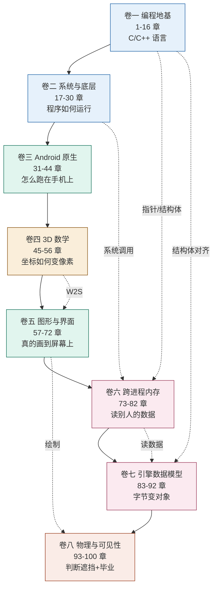
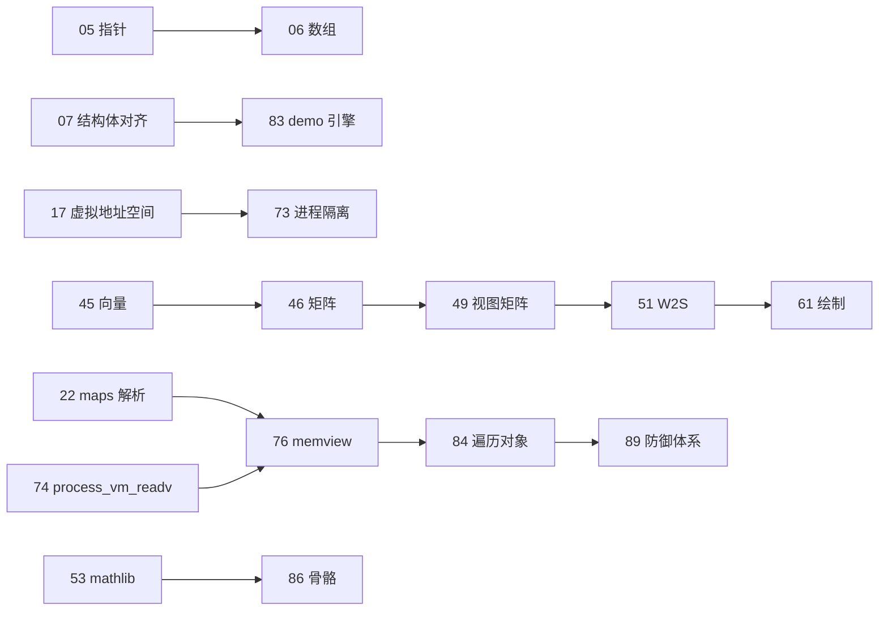
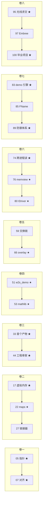

# 附录 H · 学习路径与依赖图

> [!abstract] 怎么用
> 这篇回答两个问题：**"这 100 章之间是什么关系"** 和 **"我该按什么顺序读"**。
> 包含四张依赖图（Mermaid）和四条按背景定制的速成路径。

## 一、总览：八卷的流向



**实线是"推荐顺序"，虚线是"跨卷依赖"。**

## 二、章节级依赖：必须先学的 12 章

不是所有章都同等重要。这 12 章是**后面反复用到的地基**：



**读完这 12 章，后面 88 章都是它们的组合应用。**

### 依赖关系表（谁需要谁）

| 章 | 需要先学 | 后续被谁用 |
|---|---|---|
| 05 指针 | 04 | 全部 |
| 07 结构体对齐 | 05、06 | 83、85、86、98 |
| 17 虚拟地址空间 | 无 | 73-82、89 |
| 21 系统调用 | 17 | 74 |
| 22 maps | 17、18 | 76、89 |
| 45 向量 | 无 | 46-56、95、96 |
| 46 矩阵 | 45 | 47-52 |
| 47 旋转 | 46 | 86 |
| 51 W2S | 46-50 | 全部绘制 |
| 53 mathlib | 45-52 | 54-56、86 |
| 74 process_vm | 17、21 | 75-82 |
| 76 memview | 17、22 | 83-92 |

## 三、卷内关键节点：每卷的"不可跳"



**标 ★ 的是"跳了后面会卡住"的章节。**

## 四、四条速成路径

不同背景的人不必走同一条路。

### 路径 A：完全零基础（60 天，标准路径）

**读**：全部 100 章 + 附录 A-G
**跳过**：无
**必做练习**：每章的"动手" + 每卷的综合练习 + 毕业项目

| 阶段 | 天 | 重点 |
|---|---|---|
| 卷一 | 1-10 | 指针和结构体要慢，别急 |
| 卷二 | 11-20 | 概念多，代码少 |
| 卷三 | 21-28 | 环境坑多，耐心 |
| 卷四 | 29-36 | 数学，多手算 |
| 卷五 | 37-47 | 最长，Vulkan 抄模板 |
| 卷六 | 48-52 | 动手量最大 |
| 卷七 | 53-56 | 造 demo 引擎 |
| 卷八 | 57-60 | 收束 + 毕业 |

### 路径 B：有编程基础（40 天）

**可跳过**：第 03、04、11-15 章的"原理讲解"，只做"动手"
**不可跳**：05 指针（C++ 程序员也常犯错）、07 对齐、17 虚拟内存、22 maps

| 阶段 | 天 |
|---|---|
| 卷一 | 3 天（快读 + 做练习） |
| 卷二 | 7 天 |
| 卷三 | 6 天 |
| 卷四 | 6 天 |
| 卷五 | 9 天 |
| 卷六 | 4 天 |
| 卷七 | 3 天 |
| 卷八 | 2 天 |

### 路径 C：有逆向/安全基础（25 天）

**可跳过**：卷二大部分（19、20、25、26 可略读）、卷七第 87 章
**重点补**：卷四数学、卷五图形、卷八物理（这三块是逆向背景通常缺的）

| 阶段 | 天 | 重点 |
|---|---|---|
| 卷一卷二 | 3 天 | 快速过，确认自己知道 |
| 卷三 | 3 天 | Android 特有部分要细读 |
| 卷四 | 5 天 | **重点**，慢慢算 |
| 卷五 | 7 天 | **重点**，Vulkan 要动手 |
| 卷六 | 2 天 | 大部分已熟悉 |
| 卷七 | 2 天 | 重点看第 89 章防御体系 |
| 卷八 | 3 天 | **重点**，光线追踪 |

### 路径 D：只想做出覆盖层（18 天）

**目标**：不追求完整理解，先把东西做出来。

**读**：

```
必读（12 章）
  05 指针              理解指针才能读内存
  07 结构体对齐        算偏移
  17 虚拟地址空间      理解模块基址
  22 maps 解析         找基址
  45-46 向量矩阵       基础数学
  51 W2S               坐标转换
  57-59 图形管线       概念 + Vulkan 基础
  65-66 创建窗口       核心
  71 触摸转发          能操作菜单
  74 跨进程读          读数据

选读（遇到问题再查）
  附录 C 排错手册
  深挖 E（Vulkan 问答）
  深挖 F（内存边界）
```

| 天 | 任务 |
|---|---|
| 1-2 | 05、07、17、22 |
| 3-4 | 45、46、51 + `w2s_demo` |
| 5-7 | 57、58、59 + Vulkan 探针 |
| 8-10 | 65、66 + `overlay` 跑起来 |
| 11-12 | 71 + 触摸能用 |
| 13-15 | 74、76 + 能读出 demo 进程数据 |
| 16-18 | 整合 + 调通 |

> [!warning] 路径 D 的代价
> 你会得到一个能跑的程序，但遇到 bug 时很难自己排查——
> 因为缺少卷二、三、六的系统知识。
> **建议做完路径 D 后回头补卷二。**

## 五、卡住时的求助顺序

```
1. 看该章末尾的"常见坑"表
2. 查 [[附录C-排错手册]]（按症状搜）
3. 查 [[附录G-常见问题]]（按疑问搜）
4. 查对应卷的"深挖"篇（进阶问题）
5. 读一遍该章的代码清单（[[附录E-代码清单]]）
6. 回到依赖表，确认前置章节是否真的学会了
```

**第 6 条最容易被忽略**——很多时候"这章看不懂"是因为前一章没吃透。

## 六、进度自检表

每完成一卷，用 [[附录F-学习检查点]] 的对应部分自测。


| 卷 | 检查点题号 | 及格线 |
|---|---|---|
| 一 | 1-7 | 5/7 |
| 二 | 8-14 | 5/7 |
| 三 | 15-22 | 6/8 |
| 四 | 23-29 | 5/7 |
| 五 | 30-39 | 7/10 |
| 六 | 40-46 | 5/7 |
| 七 | 47-54 | 6/8 |
| 八 | 55-62 | 6/8 |
| 综合 | 63-81 | 14/19 |

**低于及格线就别往下走**——后面的内容会加倍难懂。

## 七、时间预算的实话

| 你的情况 | 现实周期 | 每天投入 |
|---|---|---|
| 零基础，在职 | **90 天** | 1 小时 |
| 零基础，全职学 | 45 天 | 3 小时 |
| 有编程基础，在职 | 60 天 | 1 小时 |
| 有编程基础，全职学 | 30 天 | 3 小时 |
| 有逆向基础，在职 | 40 天 | 1 小时 |

**"60 天"是理想节奏**——它假设你每天能稳定投入 1~1.5 小时且不卡壳。
现实里卡壳是常态，所以给自己留 1.5 倍余量。

> [!tip] 三个提高效率的习惯
> 1. **每章必做"动手"**——只读不做的学习效率大约只有 20%
> 2. **卡住不超过 2 小时**——超时就跳过，标记下来，后面回头看往往就懂了
> 3. **每个产物都保存**——六个成品单独建目录存好，它们是你的进度证明

→ 返回 [[00-开始之前]]
