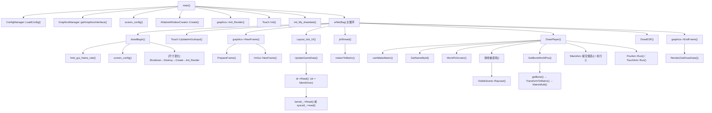

# 附录 N · 核心函数全解（源码级）

> [!abstract] 这篇解决什么
> 附录 L 做到**文件级**覆盖，附录 M 做到**类型级**覆盖，这篇做到**函数级**覆盖。
> 约 130 个函数，逐个说明：签名、作用、参数、返回值、关键实现、调用关系。
>
> **这一篇是"能改代码"到"能重写代码"的分界。**

## 一、函数总览

| 模块 | 函数数 | 代表 |
|---|---|---|
| 入口层 | 1 | `main` |
| 业务核心 | 12 | `UpdateGameData` `DrawPlayer` `Layout_tick_UI` |
| 数据解析 | 7 | `GetNameById` `GetBoneWorldPos` |
| 投影 | 2 | `camMakeMatrix` `WorldToScreen` |
| 数学工具 | 7 | `rotatorToMatrix` `GetForward` |
| 驱动层 | 约 30 | `HandleVirtualMemoryRWEvent` `IoCommitAndWait` |
| 驱动兼容层 | 约 12 | `MemDriver::Open` `SysHal::pvm` |
| 配置 | 3 | `LoadConfig` `SaveConfig` `CryptoProcess` |
| 自瞄三套 | 约 20 | `提交候选` `执行` `写入角度` |
| 触摸 | 14 | `Init` `Upload` `UpdateImGuiInput` |
| 渲染 | 约 20 | `Init_Render` `NewFrame` `Render` |
| Vulkan 加载 | 2 | `InitVulkan` |
| 物理与可见性 | 约 12 | `VisibleScene::UpdateMesh` |
| 工具函数 | 28 | `getSystemProperty` `genRandomString` |

## 二、入口层

### `main(int argc, char *argv[])` — `src/main.cpp:10`

**主循环的全部内容。**

```cpp
int main(int argc, char *argv[]) {
    ConfigManager::LoadConfig();                       // ① 读配置
    ::graphics = GraphicsManager::getGraphicsInterface(); // ② 创建渲染后端
    ::screen_config();                                 // ③ 取屏幕信息
    ::native_window_screen_x = ::displayInfo.width;    // ④ 记录尺寸
    ::native_window_screen_y = ::displayInfo.height;
    ::abs_ScreenX = ::displayInfo.width;
    ::abs_ScreenY = ::displayInfo.height;
    ::window = android::ANativeWindowCreator::Create(   // ⑤ 创建图层
        "test", native_window_screen_x, native_window_screen_y,
        ConfigManager::Settings.过录制);
    ::graphics->Init_Render(::window, native_window_screen_x, native_window_screen_y); // ⑥
    Touch::Init({(float)::abs_ScreenX, (float)::abs_ScreenY}, true);  // ⑦ 触摸
    Touch::setOrientation(displayInfo.orientation);     // ⑧ 朝向
    ::init_My_drawdata();                               // ⑨ 字体与样式

    static bool flag = true;
    while (flag) {                                      // ⑩ 主循环
        drawBegin();                                    //    帧率 + 尺寸检查
        Touch::UpdateImGuiInput();                      //    喂触摸给 ImGui
        graphics->NewFrame(true);                       //    ImGui 新帧
        Layout_tick_UI(&flag);                          //    菜单 + 数据更新
        pXthread();                                     //    刷新相机汇总
        DrawPlayer(ImGui::GetForegroundDrawList());     //    ESP
        DrawESP(ImGui::GetForegroundDrawList());        //    物理网格
        graphics->EndFrame();                           //    提交渲染
    }

    Touch::Close();                                     // ⑪ 清理
    graphics->Shutdown();
    android::ANativeWindowCreator::Destroy(::window);
    return 0;
}
```

**10 个初始化步骤的顺序有讲究**：

| 顺序 | 为什么不能换 |
|---|---|
| ① 配置最先 | 后面要用 `Settings.过录制`、`Settings.syscall驱动` |
| ② 渲染后端 | ③~⑨ 都要用它 |
| ③ 屏幕信息 | ④ 要用 `displayInfo` |
| ⑤ 建窗口 | ⑥ 要用 `window` |
| ⑦ 触摸 | 初始化时会读 `/dev/input`，可能较慢 |
| ⑨ 字体 | 必须在 `Init_Render` 之后（ImGui context 已创建） |

**注意 `flag` 是 `static bool`** —— 因为 `Layout_tick_UI(&flag)` 要改它（关窗口时置 false）。

**注意 `DrawPlayer` 和 `DrawESP` 都传 `GetForegroundDrawList()`** ——
意味着它们画在**菜单之上**（第 61 章讨论过这个选择）。

## 三、业务核心（draw_Gui.cpp）

### 3.1 初始化类（3 个）

| 函数 | 作用 | 关键点 |
|---|---|---|
| `M_Android_LoadFont(SizePixels)` | 加载内嵌黑体 | `FontDataOwnedByAtlas = false`（否则 free 静态内存崩溃） |
| `init_My_drawdata()` | 设置样式 | `StyleColorsLight()` + `ScaleAllSizes(3.0f)`（手机 DPI 高） |
| `DrawInit()` | 初始化驱动 | 选后端 → `Open` → 找 PID → 找模块基址 → 置 `初始化 = true` |

**`DrawInit` 的完整逻辑**（这是"点一下按钮才开始工作"的入口）：

```cpp
void DrawInit() {
    // ① 驱动只打开一次
    if (!g_driver.IsStarted()) {
        const int mode = ConfigManager::Settings.syscall驱动
                       ? MemDriver::MODE_SYSCALL : MemDriver::MODE_KERNEL;
        if (!g_driver.Open(mode)) {
            __android_log_print(ANDROID_LOG_ERROR, "Driver", "初始化失败: %s (%s)",
                                g_driver.CurrentModeName(), g_driver.LastError());
            return;                                    // 失败就退出，不继续
        }
        TouchAim::g_kernel = g_driver.kernel();         // ★ 把内核后端给自瞄
        PovAim::g_kernel   = g_driver.kernel();
    }

    // ② 找进程
    int gamePid = dr->GetPid("com.idreamsky.klbqm");
    if (gamePid <= 0) { printf("游戏未启动\n"); return; }
    dr->SetGlobalPid(gamePid);

    // ③ 找模块基址
    uint64_t moduleBase = 0;
    if (!dr->GetModuleAddress("libUE4.so", 0, &moduleBase, true)) {
        printf("libUE4.so 未找到\n"); return;
    }
    libUE4 = static_cast<long int>(moduleBase);
    AppBase.libUE4 = libUE4;
    初始化 = true;                                      // ★ 到这里才算就绪
}
```

**三个关键设计**：

| 设计 | 意义 |
|---|---|
| `IsStarted()` 判断 | 驱动只能打开一次（第 80 章的原因） |
| 每步失败立即 `return` | 不带着半成品状态继续 |
| `初始化` 标志 | 所有业务函数的第一行都检查它 |

### 3.2 数据获取（1 个，最重要）

### `UpdateGameData()` — `draw_Gui.cpp:79`

**这是整个项目的"数据入口"**。一次调用读回所有需要的数据。

```cpp
void UpdateGameData() {
    if (!初始化) return;                                    // ① 守卫

    // ===== 全局静态 =====
    GName     = (libUE4 + 0xb236b00);                       // ② FName 池
    MatrixPtr = dr->Read<uint64_t>(                         // ③ 矩阵指针（三级链）
                    dr->Read<uint64_t>(libUE4 + 0xB3C5D00) + 0x20) + 0x270;

    MatrixData = Matrix{};
    if (MatrixPtr != 0) {
        dr->Read((uintptr_t)MatrixPtr, &MatrixData, sizeof(MatrixData));  // 64 字节
    }

    // ===== 世界与关卡 =====
    Uworld = static_cast<long int>(dr->Read<uint64_t>(libUE4 + 0xB3EC650));
    if (Uworld == 0) return;                                // ④ 每跳判空
    Uleve  = static_cast<long int>(dr->Read<uint64_t>(Uworld + 0x30));
    if (Uleve == 0) return;
    Arrayaddr = static_cast<long int>(dr->Read<uint64_t>(Uleve + 0x98));  // ⑤ Actor 数组
    Count     = dr->Read<int>(Uleve + 0xa0);                // ⑥ 元素个数

    // ===== 玩家控制器（五级链）===== 
    PlayerController = static_cast<long int>(dr->Read<uint64_t>(
        dr->Read<uint64_t>(
            dr->Read<uint64_t>(
                dr->Read<uint64_t>(Uworld + 0x188) + 0x38) + 0x0) + 0x30));
    if (PlayerController == 0) return;

    MySelf  = static_cast<long int>(dr->Read<uint64_t>(PlayerController + 0x390));  // 自己的 Pawn
    玩家相机 = static_cast<long int>(dr->Read<uint64_t>(PlayerController + 0x3A8));  // 相机

    // ===== 武器链（5 级，可能失败）=====
    uint64_t CachedPMCharacter = dr->Read<uint64_t>(PlayerController + 0xB38);
    if (CachedPMCharacter == 0) return;
    uint64_t InventoryComponent = dr->Read<uint64_t>(CachedPMCharacter + 0x7B0);
    if (InventoryComponent == 0) return;
    uint64_t CurrentWeapon = dr->Read<uint64_t>(InventoryComponent + 0x15C0);
    if (CurrentWeapon == 0) return;
    uint64_t AttackComponent = dr->Read<uint64_t>(CurrentWeapon + 0x848);
    if (AttackComponent == 0) return;
    ProjectilesData  = dr->Read<uint64_t>(AttackComponent + 0x280);
    ProjectilesCount = dr->Read<int>(AttackComponent + 0x288);

    // ===== 相机三要素（一次连续读）=====
    相机位置 = Vector3A(); 相机旋转 = Vector3A(); 相机FOV = 0.0f;
    if (玩家相机 != 0) {
        dr->Read((uintptr_t)玩家相机 + 0x2300, &相机位置, sizeof(相机位置));  // 12 字节
        dr->Read((uintptr_t)玩家相机 + 0x230C, &相机旋转, sizeof(相机旋转));  // 12 字节
        相机FOV = dr->Read<float>((uintptr_t)玩家相机 + 0x2318);            // 4 字节
    }

    // ===== 同步到 AppBase =====
    AppBase.PlayerController = PlayerController;
    AppBase.CameraManager    = 玩家相机;
    AppBase.AcknowledgedPawn = MySelf;
    AppBase.CameraCache      = 玩家相机 + 0x2300;
    AppBase.PovPtr           = 玩家相机 + 0x2300;
    AppBase.Location         = Vec3(相机位置.X, 相机位置.Y, 相机位置.Z);
    AppBase.Rotation         = Rotator{相机旋转.X, 相机旋转.Y, 相机旋转.Z};
    AppBase.Fov              = 相机FOV;

    // ===== PovAim 的"真实朝向"（用于抑制输入时的基准）=====
    PovAim::真实朝向 = Rotator{相机旋转.X, 相机旋转.Y, 相机旋转.Z};
    if (!PovAim::holdActive && !PovAim::onTarget) {
        PovAim::真实朝向有效 = true;
    }

    // ===== 把 Config 搬到三套自瞄的 Cfg =====
    SilentAim::Cfg.启用     = ConfigManager::Settings.自瞄启用;
    SilentAim::Cfg.无视遮挡 = ConfigManager::Settings.自瞄无视遮挡;
    // ... 共 14 行搬运
    TouchAim::Cfg.启用   = ConfigManager::Settings.触摸自瞄启用;
    // ... 共 8 行
    PovAim::Cfg.enable        = ConfigManager::Settings.视角自瞄启用;
    // ... 共 4 行
}
```

**五处值得学的设计**：

| 设计 | 为什么 |
|---|---|
| **每跳判空后立即 return** | 任何一级失空都说明数据不可用（第 84 章的三层防御） |
| **相机三要素用一次 `Read` 读连续内存** | 0x2300/0x230C/0x2318 是连续的（第 90 章） |
| **同步到 `AppBase`** | 让其它模块只读 `AppBase`，不再各自去读（第 81 章"避免重复读"） |
| **Config → Cfg 的搬运** | 解耦：配置层不改自瞄层的结构 |
| **`真实朝向有效` 的条件** | 只在"没在抑制输入、没对准目标"时才更新基准（避免自噬） |

**26 行搬运代码是个设计瑕疵**：如果 `Config` 直接用 `AimConfig` 类型，
就能省掉这些重复代码。但现在这样有个好处——
`Config` 是纯数据（可 XOR 落盘），`AimConfig` 带运行时状态，职责分明。

### 3.3 过滤与判定（3 个）

```cpp
static bool IsValidObject(uint64_t address) {                 // :175
    return address > 0x10000000ULL && address < 0x10000000000ULL &&
           (address % 4) == 0;
}

static bool IsFiniteScreenPoint(const Vector2A &point) {      // :180
    return std::isfinite(point.X) && std::isfinite(point.Y);
}

static bool 射线被遮挡(const Vector3A &from, const Vector3A &to) {   // :184
    if (DynamicLoadScene == nullptr || HeightFieldScene == nullptr) return false;
    physx::PxVec3 origin(from.X, from.Y, from.Z);
    physx::PxVec3 target(to.X, to.Y, to.Z);
    if (DynamicLoadScene->Raycast(origin, target).hit.geomID != RTC_INVALID_GEOMETRY_ID)
        return true;
    if (HeightFieldScene->Raycast(origin, target).hit.geomID != RTC_INVALID_GEOMETRY_ID)
        return true;
    return false;
}
```

| 函数 | 判据依据 | 详见 |
|---|---|---|
| `IsValidObject` | 范围 + 4 字节对齐 | 第 89 章（八层防御的①②层） |
| `IsFiniteScreenPoint` | `isfinite` 同时拦 NaN 和 inf | 第 26 章 |
| `射线被遮挡` | 两个场景任一命中即遮挡 | 第 95、98 章 |

**`射线被遮挡` 的三个细节**：

1. **只查两个场景**（`DynamicLoadScene` + `HeightFieldScene`），
   不查 `DynamicRigidScene`（动态物体不适合做遮挡，第 98 章解释过）
2. **先判空**：PhysX 未初始化时直接返回"不遮挡"（安全默认值）
3. **`geomID != RTC_INVALID_GEOMETRY_ID`** 是 Embree 的命中判断（第 97 章）

### 3.4 绘制主循环（1 个，最复杂）

### `DrawPlayer(ImDrawList *draw)` — `draw_Gui.cpp:193`

**这是全项目最长的函数（约 265 行）**，逻辑分五段：

```cpp
void DrawPlayer(ImDrawList *draw) {
    // ===== 第一段：前置守卫（:194）=====
    if (!初始化 || draw == nullptr || MySelf == 0 || 玩家相机 == 0 ||
        Arrayaddr == 0 || Count <= 0 || 相机FOV <= 0.0f) {
        TouchAim::Release();      // ★ 释放触摸（避免留着手指数不到目标）
        PovAim::Release();
        return;
    }

    // ===== 第二段：构建投影矩阵（:201）=====
    MinimalViewInfo camViewInfo;
    camViewInfo.Location = Vec3(相机位置.X, 相机位置.Y, 相机位置.Z);
    camViewInfo.Rotation = Rotator{相机旋转.X, 相机旋转.Y, 相机旋转.Z};
    camViewInfo.FOV = 相机FOV;
    camMakeMatrix(camViewInfo);                    // ★ 每帧一次

    // ===== 第三段：准备自瞄状态（:207）=====
    人数值 = 0;
    有目标物体 = false;
    float 最近目标距离 = 1e30f;

    SilentAim::本帧有自瞄启用 = (SilentAim::Cfg.启用 || TouchAim::Cfg.启用 || PovAim::Cfg.enable);
    SilentAim::刷新基准朝向();
    SilentAim::重置目标();

    // ===== 第四段：遍历所有 Actor（:215）=====
    for (int i = 0; i < Count; ++i) { /* ... 见下 ... */ }

    // ===== 第五段：执行自瞄 + 画目标点 + 人数（:420）=====
    bool 本帧瞄准 = false;
    PovAim::设置屏幕((int)displayInfo.width, (int)displayInfo.height);
    if (PovAim::Cfg.enable) {          // ★ 优先级 1
        本帧瞄准 = PovAim::Run();
        TouchAim::Release();
    } else if (TouchAim::Cfg.启用) {    // ★ 优先级 2
        本帧瞄准 = TouchAim::Run();
        PovAim::Release();
    } else {                            // ★ 优先级 3
        本帧瞄准 = SilentAim::执行();
        PovAim::Release();
        TouchAim::Release();
    }

    if (本帧瞄准 && SilentAim::Cfg.画目标点 && SilentAim::当前目标.有效) {
        /* 画目标圈 + 连线 */
    }
    if (ConfigManager::Settings.人数) {
        /* 画人数 */
    }
}
```

**第五段的三个 `Release()` 是关键**：

```
选了 PovAim  → 释放 TouchAim（防止它残留按下状态）
选了 TouchAim → 释放 PovAim
选了 SilentAim → 两个都释放
```

**为什么必须释放**：`Release()` 会调 `TouchUp` 通知内核抬起手指。
如果不释放，上一次选中的自瞄会一直"按着屏幕"→ 玩家的触摸全被吃掉。

**第四段的遍历逻辑**（这是数据解析的主体，约 200 行）：

```cpp
for (int i = 0; i < Count; ++i) {
    // ① 读对象指针 + 排除自己和非法
    const uint64_t objectAddress = dr->Read<uint64_t>((uintptr_t)Arrayaddr + 0x8ULL * i);
    if (!IsValidObject(objectAddress) || objectAddress == (uint64_t)MySelf) continue;

    // ② 读名字（2 次 I/O：条目头 + 字符数据）
    std::string name_ = GetNameById(dr->Read<uint32_t>(objectAddress + 0x18));

    // ③ 读胶囊体数值（目前没用到，读了但没使用）
    const float 胶囊体数值 = dr->Read<float>(dr->Read<uint64_t>(objectAddress + 0x380) + 0x54C);

    // ④ 读 RootComponent → 世界坐标
    const uint64_t rootComponent = dr->Read<uint64_t>(objectAddress + 0x168);
    if (!IsValidObject(rootComponent)) continue;
    Vector3A rootWorld;
    if (!dr->Read(rootComponent + 0x1F0, &rootWorld, sizeof(rootWorld))) continue;

    // ⑤ 遮挡判定（只在开方框/射线且 PhysX 就绪时做）
    const bool 被遮挡 = (physx已初始化 &&
                        (ConfigManager::Settings.方框 || ConfigManager::Settings.射线)) &&
                        射线被遮挡(相机位置,
                                  Vector3A(rootWorld.X, rootWorld.Y, rootWorld.Z + 100.0f));

    // ⑥ 投影三点：根、头顶(+165)、脚底(-5)
    Vector2A rootScreen, topScreen, bottomScreen;
    if (!WorldToScreen(rootWorld, rootScreen)) continue;
    if (!WorldToScreen(Vector3A(rootWorld.X, rootWorld.Y, rootWorld.Z + 165.0f), topScreen)) continue;
    if (!WorldToScreen(Vector3A(rootWorld.X, rootWorld.Y, rootWorld.Z - 5.0f), bottomScreen)) continue;
    if (!IsFiniteScreenPoint(rootScreen) || !IsFiniteScreenPoint(topScreen) ||
        !IsFiniteScreenPoint(bottomScreen)) continue;

    // ⑦ 记录"最近目标"（屏幕距离）
    const float 目标dx = rootScreen.X - px;
    const float 目标dy = rootScreen.Y - py;
    const float 目标距离 = 目标dx * 目标dx + 目标dy * 目标dy;   // ★ 平方，不开方
    if (目标距离 < 最近目标距离) {
        最近目标距离 = 目标距离;
        目标物体位置 = Vec3(rootWorld.X, rootWorld.Y, rootWorld.Z);
        有目标物体 = true;
    }

    // ⑧ 计算方框（用 boxSpan 保持宽高比）
    const float boxSpan = bottomScreen.Y - topScreen.Y;
    if (!std::isfinite(boxSpan) || boxSpan <= 1.0f) continue;
    const float boxX = rootScreen.X - boxSpan / 4.0f;   // ★ 宽度 = 高度的一半
    const float boxY = bottomScreen.Y;
    const float boxWidth = boxSpan / 2.0f;
    const float boxTop = boxY - boxWidth;
    const float boxBottom = boxY + boxWidth;
    const float boxRight = boxX + boxWidth;
    float labelY = boxTop - 20.0f;

    // ⑨ 屏幕外剔除
    if (!std::isfinite(boxWidth) || boxWidth <= 1.0f ||
        boxWidth > (float)abs_ScreenX ||
        boxRight < 0.0f || boxX > (float)abs_ScreenX ||
        boxBottom < 0.0f || boxTop > (float)abs_ScreenY) continue;

    // ⑩ 类名绘制（调试用）
    if (ConfigManager::Settings.类名) { draw->AddText(...); labelY -= 20.0f; }

    // ⑪ 只处理角色
    if (name_.find("BP_Character") == std::string::npos) continue;
    人数值++;

    // ⑫ 提交自瞄候选
    if (SilentAim::Cfg.启用 || TouchAim::Cfg.启用 || PovAim::Cfg.enable) {
        const bool 是人机 = (name_.find("BP_Character_JiaRen") != std::string::npos);
        if (SilentAim::Cfg.包含人机 || !是人机) {
            Vec3 瞄准点(rootWorld.X, rootWorld.Y, rootWorld.Z + SilentAim::Cfg.高度偏移);
            bool 骨骼取到 = false;
            if (SilentAim::Cfg.骨骼部位 != 0) {
                /* 读骨骼 → 覆盖瞄准点 */
            }
            bool 瞄准点被遮挡 = false;
            if (physx已初始化 && !SilentAim::Cfg.无视遮挡) {
                瞄准点被遮挡 = 射线被遮挡(相机位置, Vector3A(瞄准点.x, 瞄准点.y, 瞄准点.z));
            }
            SilentAim::提交候选(objectAddress, 瞄准点, 瞄准点被遮挡);
        }
    }

    // ⑬ 人机/真人标签
    if (ConfigManager::Settings.人机) {
        name_ = (name_.find("BP_Character_JiaRen") != std::string::npos) ? "人机" : "真人";
    }

    // ⑭ 画方框
    if (ConfigManager::Settings.方框) {
        draw->AddRect(ImVec2(boxX, boxTop), ImVec2(boxRight, boxBottom),
                      被遮挡 ? BlockBoxColor : BoxColor, 0.0f, 0, 1.0f);
        if (name_ == "人机" || name_ == "真人") {
            draw->AddText(ImVec2(boxX, boxTop), ImColor(255,255,0,255), name_.c_str());
        }
    }

    // ⑮ 画射线
    if (ConfigManager::Settings.射线) {
        draw->AddLine(ImVec2(px, 130.0f), ImVec2(rootScreen.X, boxTop),
                      被遮挡 ? BlockLineColor : LineColor, 1.0f);
    }

    // ⑯ 画骨骼（15 点 14 段）
    if (ConfigManager::Settings.骨骼 || ConfigManager::Settings.骨骼索引) {
        /* 读 Mesh → 骨骼数组 → C2W → 15 个世界坐标 → 投影 → 连线 */
    }
}
```

**14 个步骤，包含 8 处 `continue`（剔除）**。这是第 52 章"剔除顺序"的真实代码。

**三个可优化点**（第 81 章讲过原理）：

| 位置 | 现状 | 优化方向 |
|---|---|---|
| ① 循环里逐个读指针 | N 次 I/O | 一次读完整个数组 |
| ②③④ 每个字段单独读 | 5~10 次/对象 | 批量读（iovec 数组） |
| ⑥ 三次 `WorldToScreen` | 三次矩阵乘 | 已经是最优（必须三个点） |
| ⑯ 骨骼逐根读 | 15 次/对象 | 一次读完整个骨骼数组 |

**`boxWidth = boxSpan / 2.0f` 的含义**：方框宽度取"脚到头的屏幕距离"的一半。
这样**远处的人方框自动变小**，符合透视。

**注意 ③ `胶囊体数值` 读了但没用** —— 死代码。
（应该是早期版本用来画胶囊的，后来改成画方框。）

### 3.5 帧控制与界面（5 个）

```cpp
void screen_config()                     // :459  获取屏幕信息 + 处理镜像
{
    static std::chrono::steady_clock::time_point lastTime{};
    const auto now = std::chrono::steady_clock::now();
    if (now - lastTime < std::chrono::milliseconds(250)) return;   // ★ 250ms 节流
    const auto nextDisplayInfo = android::ANativeWindowCreator::GetDisplayInfo();
    if (nextDisplayInfo.width > 0 && nextDisplayInfo.height > 0) {
        displayInfo = nextDisplayInfo;
    }
    if (!ConfigManager::Settings.过录制) {
        android::ANativeWindowCreator::ProcessMirrorDisplay();     // ★ 镜像处理
    }
    lastTime = now;
}

static void limit_gui_frame_rate()       // :474  限帧（累积对齐）
{
    static std::chrono::steady_clock::time_point nextFrame{};
    const auto now = std::chrono::steady_clock::now();
    const int targetFps = std::clamp(ConfigManager::Settings.gui_frame_rate, 60, 185);
    const auto framePeriod = std::chrono::duration_cast<std::chrono::steady_clock::duration>(
        std::chrono::duration<double>(1.0 / targetFps));

    if (nextFrame == std::chrono::steady_clock::time_point{}) nextFrame = now;
    if (now < nextFrame) std::this_thread::sleep_until(nextFrame);

    const auto frameStart = std::chrono::steady_clock::now();
    nextFrame += framePeriod;                                   // ★ 累加不用赋值
    if (nextFrame <= frameStart) nextFrame = frameStart + framePeriod;
}

void drawBegin()                         // :489  帧开始（尺寸检查 + 重建）
{
    limit_gui_frame_rate();
    screen_config();
    // ... 检测 displaySizeChanged → 重建窗口
    // ... 设置 GameTools::ScreenSize = 屏幕/2
    // ... px = 屏幕宽 * 0.5, py = 屏幕高 * 0.5
}

void Layout_tick_UI(bool *main_thread_flag)  // :538  菜单 UI（约 240 行）
{
    UpdateGameData();                        // ★ 先更新数据
    ImGui::Begin("晚宀是男娘", main_thread_flag);
    // ... 窗口位置恢复
    if (!ImGui::BeginTabBar("MainTabs")) { ImGui::End(); return; }
    // ... 三个标签页：主功能 / 自瞄 / 信息
    ImGui::EndTabBar();
    g_window = ImGui::GetCurrentWindow();    // ★ 记录窗口（触摸命中测试要用）
    ImGui::End();
}
```

**`drawBegin` 的重建逻辑**（第 59、68 章的实践）：

```cpp
if (::permeate_record_ini || displaySizeChanged) {
    // 保存当前窗口位置尺寸
    if (g_window != nullptr) {
        LastCoordinate.Pos_x = g_window->Pos.x;
        LastCoordinate.Pos_y = g_window->Pos.y;
        LastCoordinate.Size_x = g_window->Size.x;
        LastCoordinate.Size_y = g_window->Size.y;
    }
    if (displaySizeChanged) {
        native_window_screen_x = displayInfo.width;      // 更新尺寸
        /* ... */
    }
    graphics->Shutdown();                                // ★ 先关渲染
    android::ANativeWindowCreator::Destroy(window);      // ★ 再关窗口
    window = android::ANativeWindowCreator::Create(      // ★ 重建
        "test_sysGui", native_window_screen_x, native_window_screen_y,
        ConfigManager::Settings.过录制);
    graphics->Init_Render(window, ...);                  // ★ 再初始化
    init_My_drawdata();                                  // ★ 重载字体
    g_window = nullptr;
    permeate_record_ini = true;
    Touch::UpdateDisplaySize({...});                     // ★ 更新触摸
}
```

**五步顺序不能乱**：Shutdown → Destroy → Create → Init_Render → 字体。
（因为是"完全重建"，不是"调整"。）

**`Layout_tick_UI` 末尾的 `g_window = ImGui::GetCurrentWindow()`**：
这是给第 71 章的"命中测试"用的——触摸时判断"是否点在菜单上"。

## 四、数据解析（variable.h）

| 函数 | 签名 | 作用 | 关键点 |
|---|---|---|---|
| `getBone` | `BoneTransform getBone(uint64_t addr)` | 读一根骨骼 | 先判 `addr == 0`，一次读 40 字节 |
| `TransformToMatrix` | `Matrix TransformToMatrix(const BoneTransform&)` | 四元数→矩阵 | 同时应用了 Scale3D |
| `MatrixMulti` | `Matrix MatrixMulti(const Matrix&, const Matrix&)` | 矩阵相乘 | 三重循环 64 次乘法 |
| `MarixToVector` | `Vector3A MarixToVector(const Matrix&)` | 取平移分量 | 返回 `M[3][0..2]`（**注意拼写：Marix 是笔误**） |
| `GetBoneWorldPos` | `Vector3A GetBoneWorldPos(uint64_t boneArray, int index, const Matrix& c2w)` | 骨骼世界坐标 | `MatrixMulti(局部, C2W)` |
| `AppendUtf8` | `static void AppendUtf8(std::string&, char32_t)` | UTF-32→UTF-8 | 四段判断（1/2/3/4 字节） |
| `GetNameById` | `std::string GetNameById(uint32_t nameId)` | FName 解析 | 位拆解 + 长度上界检查 |

**`GetBoneWorldPos` 的实现与第 86 章对比**：

```cpp
inline Vector3A GetBoneWorldPos(uint64_t boneArray, int index, const Matrix& c2w) {
    return MarixToVector(MatrixMulti(
        TransformToMatrix(getBone(boneArray + index * BONE_STRIDE)),  // ① 局部
        c2w                                                            // ② C2W
    ));
}
```

**两次 I/O**：`getBone` 一次，C2W 在主循环里一次（不在这个函数里）。
所以对 15 根骨骼，共 15 + 1 = 16 次 I/O。

**优化空间**：一次读完整个骨骼数组（第 81、86 章）→ 从 16 次降到 1 次。

**`GetNameById` 的完整逻辑**（第 85 章讲过，这里是代码级别的补充）：

```cpp
std::string GetNameById(uint32_t nameId) {
    uint32_t blockIdx = nameId >> 16;              // 高 16 位 = 块号
    uint32_t blockOff = nameId & 0xFFFF;           // 低 16 位 = 块内偏移/2

    uint64_t blockAddr = 0;
    if (!dr->Read(GName + 0x40 + blockIdx * 8, &blockAddr, 8) || !blockAddr) {
        return {};                                  // ① 块指针读失败或为 0
    }

    uint64_t entryAddr = blockAddr + blockOff * 2;  // ★ ×2 还原字节偏移

    uint16_t header = 0;
    if (!dr->Read(entryAddr, &header, 2)) return {}; // ② 条目标头

    uint32_t len = header >> 6;                     // 高 10 位 = 长度
    bool  isWide = header & 1;                      // 最低位 = 是否宽字符

    if (len == 0 || len > 1024) return {};          // ★ ③ 上界检查

    if (isWide) {
        std::u32string u32(len, 0);
        if (!dr->Read(entryAddr + 2, u32.data(), len * 4)) { }   // 每个字符 4 字节
        std::string s; s.reserve(len * 3);
        for (char32_t c : u32) AppendUtf8(s, c);
        return s;
    } else {
        std::string s(len, 0);
        if (!dr->Read(entryAddr + 2, s.data(), len)) return {};
        return s;
    }
}
```

**四个防御点**（① 块指针、② 头部、③ 长度、④ 数据）——
每一处都可能因为游戏状态变化而失败，任一失败都返回空字符串（不崩）。

**一处小瑕疵**：`if (!dr->Read(..., u32.data(), len * 4)) { }` 的空代码块——
读取失败时没有 `return {}`，会继续用（可能是空的）`u32` 拼字符串。
**症状**：宽字符名字读失败时返回空字符串而不是提前退出（结果相同但语义不清）。

## 五、投影（WorldToScreen.h）

### `camMakeMatrix(const MinimalViewInfo&) — :31`

**14 行代码构建视图×投影矩阵**（第 49、50 章推导过）。

```cpp
static inline void camMakeMatrix(const MinimalViewInfo& camViewInfo) {
    if (camViewInfo.FOV < 1.0f || camViewInfo.FOV > 179.0f) return;   // ① FOV 范围
    float camX = camViewInfo.Location.x;
    float camY = camViewInfo.Location.y;
    float camZ = camViewInfo.Location.z;
    if (camX == 0.0f && camY == 0.0f && camZ == 0.0f) return;         // ② 位置全 0
    if (camX != camX || camY != camY || camZ != camZ) return;          // ③ NaN

    float pitch = camViewInfo.Rotation.Pitch * PI / 180.0f;            // ④ 度→弧度
    float yaw   = camViewInfo.Rotation.Yaw   * PI / 180.0f;
    float sp = sinf(pitch), cp = cosf(pitch);                           // ⑤ 三角函数
    float sy = sinf(yaw),   cy = cosf(yaw);
    float t  = tanf(camViewInfo.FOV * 0.5f * PI / 180.0f);              // ⑥ tan(半角)
    if (t == 0.0f) t = 0.0001f;

    // 深度行（forward）
    matrix[3]  = cy * cp;
    matrix[7]  = sy * cp;
    matrix[11] = sp;
    matrix[15] = -(camX * matrix[3] + camY * matrix[7] + camZ * matrix[11]);   // ⑦ = -F·C

    // right 行（除以 t）
    matrix[0]  = -sy / t;
    matrix[4]  =  cy / t;
    matrix[8]  =  0.0f;
    matrix[12] = -(camX * (-sy) + camY * cy) / t;

    // up 行（除以 t）
    matrix[1]  = (-sp * cy) / t;
    matrix[5]  = (-sp * sy) / t;
    matrix[9]  = (cp)       / t;
    matrix[13] = -(camX * (-sp * cy) + camY * (-sp * sy) + camZ * cp) / t;

    // 未用
    matrix[2] = matrix[6] = matrix[10] = matrix[14] = 0.0f;
}
```

**三条防御（①②③）** 的作用：**读不到数据时保留上一帧的矩阵**（而不是清空）。
这样比"崩溃"或"画错"都好。

**注意 `matrix[8] = 0.0f`** —— right 行的 z 分量恒为 0。
原因是忽略 Roll（第 49 章说明过）。

### `WorldToScreen(const Vector3A&, Vector2A&) — :75`

**两个分支：用引擎矩阵 / 用自算矩阵**（第 91 章）。

```cpp
inline bool WorldToScreen(const Vector3A& obj, Vector2A& screen) {
    // ===== 分支 A：引擎矩阵 =====
    if (ConfigManager::Settings.矩阵W2S && MatrixPtr != 0) {
        const float* m = &MatrixData.M[0][0];
        const float w = m[3]*obj.X + m[7]*obj.Y + m[11]*obj.Z + m[15];
        if (w < 0.001f) return false;                              // ★ 近平面
        const float cx = m[0]*obj.X + m[4]*obj.Y + m[8] *obj.Z + m[12];
        const float cy = m[1]*obj.X + m[5]*obj.Y + m[9] *obj.Z + m[13];
        screen.X = (cx / w + 1.0f) * px;
        screen.Y = (1.0f - cy / w) * py;
        return std::isfinite(screen.X) && std::isfinite(screen.Y);
    }

    // ===== 分支 B：自算矩阵 =====
    float w = matrix[3]*obj.X + matrix[7]*obj.Y + matrix[11]*obj.Z + matrix[15];
    if (w < 0.001f) return false;

    float clip_x = matrix[0]*obj.X + matrix[4]*obj.Y + matrix[8]*obj.Z + matrix[12];
    float clip_y = matrix[1]*obj.X + matrix[5]*obj.Y + matrix[9]*obj.Z + matrix[13];

    screen.X = (clip_x / w * ConfigManager::Settings.水平焦距系数 + 1.0f) * px;
    screen.Y = (1.0f - clip_y / w * ConfigManager::Settings.垂直焦距系数) * py;
    return true;                                                    // ★ 没做 isfinite 检查！
}
```

**两个分支的差异**：

| 特性 | 分支 A（引擎矩阵） | 分支 B（自算） |
|---|---|---|
| 焦距微调 | 不支持 | ✓ 水平/垂直系数 |
| `isfinite` 检查 | ✓ 有 | ✗ **缺失** |
| 依赖 | 三级指针链 | 只需相机三要素 |

> [!warning] 分支 B 缺少 `isfinite` 检查
> 分支 A 返回 `std::isfinite(...)`，分支 B 直接 `return true`。
> 虽然前面有 `w < 0.001f` 拦住了除零，
> 但 `matrix` 数组本身可能含 NaN（来自相机数据的 NaN）。
>
> **调用方靠 `IsFiniteScreenPoint` 兜底**（第 89 章的第三道防线），
> 所以不会画出错线——但**函数自身的行为不一致**。
>
> **正规写法**：两个分支都返回 `isfinite` 检查结果。

## 六、数学工具（GameTools.cpp）

| 函数 | 作用 | 关键点 |
|---|---|---|
| `rotatorToMatrix(Rotator)` | 欧拉角→旋转矩阵 | 46 行展开式，三行是前/右/上 |
| `GetForward(Rotator)` | 取前方向 | 就是矩阵的第 0 行（`CP*CY, CP*SY, SP`） |
| `WorldToScreen(Vec2*, Vec3*)` | 投影（指针版） | 失败时填 `NAN`（第 51 章的设计） |
| `WorldToScreen(Vec2*, Vec3)` | 投影（值版） | 转发给指针版 |
| `WorldToScreen(Vec3)` | 投影（返回值版） | 返回 `Vec2` |
| `WorldToScreen(Vec2*, float*, Vec3)` | 投影 + 高度 | 额外算头顶高度差 |

**四个 `WorldToScreen` 重载** —— 为了兼容不同调用风格。
**好处**：调用方方便。**坏处**：容易搞混（哪个版本失败会怎样）。

**`WorldToScreen(Vec2*, Vec3*)` 的失败语义**：

```cpp
void WorldToScreen(Vec2 *bscreen, Vec3 *obj) {
    Vector2A s;
    if (::WorldToScreen(Vector3A(obj->x, obj->y, obj->z), s)) {
        bscreen->x = s.X;  bscreen->y = s.Y;
    } else {
        bscreen->x = NAN;  bscreen->y = NAN;      // ★ 失败填 NAN
    }
}
```

**为什么填 NAN**：NAN 会"传染"（任何算术都得 NAN），
最终被 `IsFiniteScreenPoint` 拦住。填 0 则分不清"真的在左上角"和"投影失败"。

## 七、驱动层（driver.h）

### 7.1 `IDriver` 接口的 12 个方法

| 方法 | 类型 | 作用 |
|---|---|---|
| `Read(addr, buf, size)` | 虚 | 读内存（核心） |
| `Write(addr, buf, size)` | 虚 | 写内存 |
| `GetPid(packageName)` | 虚 | 按包名找 PID |
| `GetGlobalPid()` | 虚 | 取当前 PID |
| `SetGlobalPid(pid)` | 虚 | 设置 PID |
| `GetModuleAddress(name, segIdx, out, isStart)` | 虚 | 找模块地址 |
| `DumpMemory(target, dumpPath)` | 虚 | 导出内存 |
| `GetScanRegions()` | 虚 | 取可扫描区域 |
| `Read<T>(addr)` | **非虚模板** | 读一个 T |
| `Write<T>(addr, value)` | **非虚模板** | 写一个 T |
| `ReadString(addr, maxLen)` | **非虚** | 读字符串 |

**只有 8 个虚函数**——其余靠模板方法共享实现（第 80 章）。

### 7.2 `Driver` 的公开接口（约 14 个）

```cpp
// 构造/析构
Driver(int Vslot, bool initGyro, bool initGnss);     // ★ 构造时握手 + 初始化设备

// 请求控制
void NullIo();                                       // 空请求（测试用）
void ExitKernel();                                   // 让内核线程退出

// IDriver 实现（8 个，见上表）

// 内存读写（模板重载）
template <typename T> T Read(uint64_t address);
int Read(uint64_t address, void *buffer, size_t size);      // override
template <typename T> int Write(uint64_t address, const T &value);
int Write(uint64_t address, void *buffer, size_t size);     // override

// 输入注入
void TouchDown(int slot, int x, int y, int screenW, int screenH);
void TouchMove(int slot, int x, int y, int screenW, int screenH);
void TouchUp(int slot);
void GyroReport(int x, int y, int z);
void GnssReport(int lat_e7, int lon_e7);

// 内存信息
const virtual_memory &GetMemoryInfoRef();            // ★ 返回引用，不拷贝 13 MB

// 硬件断点
const break_point &GetHwbpInfoRef();
int  SetProcessHwbpRef(std::span<const bp_point>);
void RemoveProcessHwbpRef();
int  SetProcessPtebpRef(std::span<const bp_point>);
void RemoveProcessPtebpRef();
int  SetProcessStepbpRef(std::span<const bp_point>);
void RemoveProcessStepbpRef();

// 监控
int StartSyscallMonitor(int pid);   void StopSyscallMonitor(int pid);
int StartCntvctMonitor(int pid);    void StopCntvctMonitor(int pid);

// 环境参数
bool GetEnvParams(std::string_view threadName);
const env_params &GetEnvParamsRef() const;
```

**`GetMemoryInfoRef()` 返回引用不是拷贝** —— 因为结构有 13 MB！
如果返回值（拷贝），每次调用要复制 13 MB。

**代价**：引用可能失效（下次请求会覆盖同一块内存）。
调用方必须**立即使用**，不能保存引用。

### 7.3 `Driver` 的私有实现（约 12 个）

| 方法 | 作用 | 关键点 |
|---|---|---|
| `StoreRequestOp(op)` | 写操作码 | `inline` |
| `StoreRequestStatus(s)` | 写状态 | `inline` |
| `LoadRequestStatus()` | 读状态 | `inline` |
| `IoCommitAndWait()` | **提交并等待** | 轮询 `yield`，**无超时**（第 79 章的缺陷） |
| `InitCommunication()` | 建立共享内存 + 握手 | 固定地址 `0x2025827000` |
| `InitTouch(slots)` | 初始化虚拟触摸 | `slots <= 0` 时跳过 |
| `InitGyro(enable)` | 初始化陀螺仪 | — |
| `InitGnss(enable)` | 初始化虚拟定位 | — |
| `HandleVirtualMemoryRWEvent(op, addr, buf, size)` | **读写主逻辑** | 分块 + 加锁 + 部分成功处理 |
| `HandleVirtualMemoryInfo()` | 取内存信息 | 加锁 |
| `HandleTouchEvent(op, slot, x, y, w, h)` | 触摸注入 | **含横竖屏坐标映射** |
| `HandleGyroReport(...)` | 陀螺仪上报 | 加锁 |
| `HandleGnssReport(...)` | 定位上报 | 加锁 |
| `HandleHwbpEvent(op, points)` | 硬件断点 | 加锁 + 参数拷贝 |
| `HandlePtebpEvent(op, points)` | PTE 断点 | 同上 |
| `HandleStepbpEvent(op, points)` | 单步断点 | 同上 |
| `HandleSyscallMonitorEvent(op, tgid)` | 系统调用监控 | 结果走 `dmesg`，不经共享内存 |
| `HandleCntvctMonitorEvent(op, tgid)` | 时间计数监控 | 同上 |
| `HandleEnvGetParams(threadName)` | 环境参数查询 | 拷贝线程名 |

**`HandleTouchEvent` 里的横竖屏映射**（第 69 章讲原理，这里是代码）：

```cpp
void HandleTouchEvent(request_op op, int slot, int x, int y, int screenW, int screenH) {
    std::scoped_lock<SpinLock> lock(m_mutex);
    // ★ 下面代码绝对不要使用整数除法（源码注释原话）
    if (screenW <= 0 || screenH <= 0 ||
        req->vinput_info.POSITION_X <= 0 || req->vinput_info.POSITION_Y <= 0) return;
    if (x < 0 || y < 0 || x > screenW || y > screenH) return;

    StoreRequestOp(op);
    req->vinput_info.slot = slot;
    double normX = (double)x / screenW;              // ★ 用 double 提高精度
    double normY = (double)y / screenH;

    if (screenW > screenH && req->vinput_info.POSITION_X < req->vinput_info.POSITION_Y) {
        // 横屏 + 充电口在右侧 → 交换 X/Y 并翻转
        req->vinput_info.x = (int)((1.0 - normY) * req->vinput_info.POSITION_X);
        req->vinput_info.y = (int)(normX * req->vinput_info.POSITION_Y);
    } else {
        req->vinput_info.x = (int)(normX * req->vinput_info.POSITION_X);
        req->vinput_info.y = (int)(normY * req->vinput_info.POSITION_Y);
    }
    IoCommitAndWait();
}
```

**注释"绝对不要使用整数除法"的含义**：
`x / screenW` 如果是整数除法，结果恒为 0（因为 `x < screenW`）。
必须用 `double`。**这是个隐蔽的坑**——写错了不会报错，只是坐标全是 0。

## 八、驱动兼容层

### 8.1 `MemDriver`（MemDriver.h）

| 方法 | 作用 | 关键点 |
|---|---|---|
| `Open(mode)` | 打开选定后端 | **只能打开一次**（第 80 章） |
| `IsOpen()` / `CanSwitch()` / `IsStarted()` | 状态查询 | UI 的灰显开关靠它们 |
| `CurrentMode()` / `CurrentModeName()` | 当前后端 | 用于日志与显示 |
| `AttachKernel(Driver*)` | 接入外部驱动实例 | 少见用法 |
| `Read/Write/GetPid/GetGlobalPid/SetGlobalPid/GetModuleAddress` | 转发给后端 | 8 个虚函数 |
| `DumpMemory` | 仅内核支持 | 否则返回 false |
| `GetScanRegions` | 内核走驱动，syscall 走 `/proc/pid/maps` | **两种实现** |
| `kernel()` / `syscall()` | 取具体后端 | 专属能力的入口 |
| `LastError()` | 错误信息 | UI 显示 |

**`GetScanRegions` 的双实现**（第 76 章）：

```cpp
std::vector<std::pair<uintptr_t, uintptr_t>> GetScanRegions() override {
    std::vector<std::pair<uintptr_t, uintptr_t>> regions;
    if (kernel_ != nullptr) return kernel_->GetScanRegions();   // 内核对：驱动返回

    if (syscall_ != nullptr) {                                 // syscall 对：解析 maps
        char filename[64];
        snprintf(filename, sizeof(filename), "/proc/%d/maps", GetGlobalPid());
        FILE *fp = fopen(filename, "r");
        if (fp == nullptr) return regions;
        char line[1024];
        while (fgets(line, sizeof(line), fp)) {
            unsigned long long start = 0, end = 0;
            if (sscanf(line, "%llx-%llx", &start, &end) == 2 && end > start) {
                regions.emplace_back((uintptr_t)start, (uintptr_t)end);
            }
        }
        fclose(fp);
    }
    return regions;
}
```

**注意 syscall 版本只读前两个字段**（起止地址），不做权限过滤——
因为过滤逻辑在调用方（或内核版实现里）。

### 8.2 `SysHal`（SysHal.h）

| 方法 | 作用 | 关键点 |
|---|---|---|
| `initialize(pid)` | 绑定目标进程 | 后面所有操作都用它 |
| `get_pid()` | 取绑定的 PID | MemDriver 需要 |
| `read(addr, buf, size)` | 读内存 | → `pvm(iswrite=false)` |
| `read<T>(addr)` | 模板读 | — |
| `write(addr, buf, size)` | 写内存 | → `pvm(iswrite=true)` |
| `write<T>(addr, value)` | 模板写 | — |
| `getPID(packageName)` | 按包名找 PID | 遍历 `/proc` 读 cmdline |
| `get_module_base(pid, name)` | 找模块基址 | 解析 `/proc/pid/maps` |
| `pvm(addr, buf, size, iswrite)` | **底层读写** | 构造 `iovec` + `syscall` |
| `process_v(pid, ...)` | 系统调用封装 | 调用号按架构选择 |

**`pvm` 的实现**（第 74 章的简化版）：

```cpp
bool pvm(void *address, void *buffer, size_t size, bool iswrite) {
    struct iovec local[1];
    struct iovec remote[1];
    local[0].iov_base  = buffer;
    local[0].iov_len   = size;
    remote[0].iov_base = address;
    remote[0].iov_len  = size;

    if (pid <= 0) return false;

    ssize_t bytes = process_v(pid, local, 1, remote, 1, 0, iswrite);
    return bytes == size;                    // ★ 必须是完整传输
}
```

**注意 `bytes == size` 是严格相等** ——
部分成功会被当成失败（返回 false）。
**这比内核版严格**（内核版会返回部分字节数）。

**谁更合理**：取决于调用方。如果调用方需要"部分数据也要"，
syscall 版会丢掉；内核版会保留。
**这是两个后端行为不一致的地方**（第 80 章提到的"能力差异"）。

**头文件末尾的全局对象**（第 75 章）：

```cpp
inline SysHal *driver = new SysHal();       // 全局唯一实例
inline pid_t pid = 0;

inline long getModuleBase(const char *module_name) { /* 用上面的全局 driver */ }
inline long ReadValue(long addr) { /* ... */ }
inline float ReadFloat(long addr) { /* ... */ }
inline int WriteDword(long int addr, int value) { /* ... */ }
inline int WriteFloat(long int addr, float value) { /* ... */ }
```

**这些是"遗留的 C 风格接口"** —— 用全局 `driver` 和 `pid`，
与 `MemDriver` 的面向对象设计**并存**。

> [!note] 双重接口的存在说明什么
> `SysHal` 提供两套用法：
> 1. **面向对象**：`SysHal` 类的成员方法（`MemDriver` 用这套）
> 2. **全局函数**：`ReadFloat(addr)` 之类（旧代码用这套）
>
> 这是**渐进式重构的中间状态**——旧接口没删（怕破坏调用方），
> 新接口已加。你维护老项目时会经常遇到这种情况。

## 九、配置（ConfigManager.cpp）

```cpp
namespace ConfigManager {
    int fd;
    Config Settings;
    uint8_t CRYPTO_KEY[] = {0x8B, 0x8F, 0xD3, 0xDF, 0x7B, 0xF7, 0xD, 0x9F};
    size_t  KEY_LENGTH = sizeof(CRYPTO_KEY);

    void CryptoProcess(uint8_t* data, const size_t length) {
        for (size_t i = 0; i < length; ++i) {
            data[i] ^= CRYPTO_KEY[i % KEY_LENGTH];      // ★ 循环 XOR
        }
    }

    bool LoadConfig() {
        fd = open("/data/Config", O_RDONLY);
        if (fd > 0) {
            uint8_t raw[sizeof(Config)];
            memset(raw, 0, sizeof(raw));
            ssize_t bytesRead = read(fd, raw, sizeof(raw));
            close(fd);
            if (bytesRead > 0) {
                CryptoProcess(raw, (size_t)bytesRead);       // ★ 解密（与加密同一操作）
                Config loaded;
                memset(&loaded, 0, sizeof(loaded));
                const size_t copyLen = (bytesRead < sizeof(Config))
                                     ? (size_t)bytesRead : sizeof(Config);
                memcpy(&loaded, raw, copyLen);
                if ((size_t)bytesRead < sizeof(Config)) {     // ★ 短文件补默认值
                    uint8_t* dst = reinterpret_cast<uint8_t*>(&loaded);
                    uint8_t* def = reinterpret_cast<uint8_t*>(&Settings);
                    memcpy(dst + copyLen, def + copyLen, sizeof(Config) - copyLen);
                }
                Settings = loaded;
                return true;
            }
        }
        return false;
    }

    bool SaveConfig() {
        Config ConfigSave = Settings;                         // ★ 拷贝一份再加密
        CryptoProcess(reinterpret_cast<uint8_t*>(&ConfigSave), sizeof(Config));

        fd = open("/data/Config", O_WRONLY | O_CREAT | O_TRUNC, 0660);
        if (fd > 0) {
            write(fd, &ConfigSave, sizeof(Config));
            close(fd);
            return true;
        }
        return false;
    }
}
```

**三个关键设计**：

| 设计 | 为什么 |
|---|---|
| **XOR 可逆** | 加密和解密是同一个函数（第 24 章） |
| **`SaveConfig` 先拷贝再加密** | 如果直接加密 `Settings`，内存里的配置就被"加密"了 → 程序行为全乱 |
| **短文件补默认值** | 版本升级加了字段时，旧配置文件的缺失部分用默认值填（第 12 章） |

**`SaveConfig` 的拷贝是关键细节**：

```cpp
Config ConfigSave = Settings;                 // ① 拷贝
CryptoProcess(&ConfigSave, sizeof(Config));   // ② 加密拷贝，不动原数据
write(fd, &ConfigSave, ...);                  // ③ 写文件
```

如果写成 `CryptoProcess(&Settings, ...)`，那么：
- 文件写对了
- 但**内存里的 `Settings` 变成密文** → UI 显示乱码、逻辑全错

> [!danger] 这是"原地修改参数"的经典陷阱
> 函数签名 `void CryptoProcess(uint8_t* data, size_t len)` 是**原地修改**的。
> 调用方必须自己保证"传进去的是可以改的副本"。
>
> **更安全的 API 设计**：
> ```cpp
> std::vector<uint8_t> Encrypt(const void* data, size_t len);   // 返回新数据
> ```
> 返回值形式不会意外修改调用方的数据。

## 十、自瞄三套

### 10.1 SilentAim（SilentAim.h 的 8 个函数）

| 函数 | 作用 | 关键点 |
|---|---|---|
| `长度(Vec3)` | 向量长度 | `sqrtf(x²+y²+z²)` |
| `向量转角度(Vec3)` | 方向→欧拉角 | **用 `atan2`**（第 56 章） |
| `归一角差(a, b)` | 角度差归一化 | while 循环到 ±180 |
| `选目标基准朝向()` | 取基准朝向 | 优先用 `基准朝向`，否则 `AppBase.Rotation` |
| `重置目标()` | 清空当前目标 | 每帧调用 |
| `提交候选(actor, 世界位置, 被遮挡)` | **选目标** | 距离/FOV/粘滞三重判断 |
| `刷新基准朝向()` | 更新基准 | 只在"没有目标"时更新 |
| `写入角度(Rotator)` | **写 ControlRotation** | 可选同时写 POV |
| `执行()` | 主逻辑 | 平滑 + 限速 |

**`提交候选` 的完整判断链**（第 47 章的选目标逻辑）：

```cpp
inline void 提交候选(uint64_t actor, const Vec3 &世界位置, bool 被遮挡) {
    if (AppBase.PlayerController == 0 || AppBase.CameraManager == 0) return;
    if (!Cfg.无视遮挡 && 被遮挡) return;                     // ① 遮挡过滤

    const Vec3 方向 = Vec3(世界位置.x - AppBase.Location.x, /* ... */);
    const float 世界距离 = 长度(方向);
    if (世界距离 <= 1.0f || 世界距离 > Cfg.最大距离) return;   // ② 距离过滤

    const Rotator 目标角 = 向量转角度(方向);
    const float 偏航 = std::fabs(归一角差(选目标基准朝向().Yaw,   目标角.Yaw));
    const float 俯仰 = std::fabs(归一角差(选目标基准朝向().Pitch, 目标角.Pitch));

    Vec2 屏{};
    GameTools::WorldToScreen(&屏, 世界位置);
    if (!std::isfinite(屏.x) || !std::isfinite(屏.y)) return; // ③ 投影有效性

    const float dx = 屏.x - GameTools::ScreenSize.x;
    const float dy = 屏.y - GameTools::ScreenSize.y;
    const float 屏距 = std::sqrt(dx*dx + dy*dy);              // ★ 这里开了方（但比较用）

    const bool 是小框 = (偏航 <= Cfg.视野角度 && 俯仰 <= Cfg.视野角度);        // ④ 小 FOV
    const bool 是粘滞目标 = (Cfg.粘滞 && 当前目标.有效 && actor == 当前目标.actor);
    const bool 是大框 = (偏航 <= Cfg.视野角度 + Cfg.扩大角度 &&
                        俯仰 <= Cfg.视野角度 + Cfg.扩大角度);                  // ⑤ 大 FOV

    if (是粘滞目标) {                                         // ⑥ 粘滞：直接更新
        当前目标.世界位置 = 世界位置;
        当前目标.屏幕距离 = 屏距 * Cfg.粘滞权重;              // ★ 加权，提高保持概率
        当前目标.世界距离 = 世界距离;
        当前目标.被遮挡   = 被遮挡;
        return;
    }

    const bool 在选目标范围 = 是小框 || (Cfg.粘滞 && 是大框);
    if (!在选目标范围) return;

    if (屏距 < 当前目标.屏幕距离) {                           // ⑦ 取屏距最小者
        当前目标.有效     = true;
        当前目标.actor    = actor;
        当前目标.世界位置 = 世界位置;
        当前目标.屏幕距离 = 屏距;
        当前目标.世界距离 = 世界距离;
        当前目标.被遮挡   = 被遮挡;
    }
}
```

**五个过滤 + 一个加权，就是"粘滞"的全部实现。**

**粘滞的核心技巧**：

```cpp
当前目标.屏幕距离 = 屏距 * Cfg.粘滞权重;    // 权重 0.6 → 屏距"变小"
```

锁定后的目标，其"记录屏距"被乘以 0.6（**人为变小**），
这样**新的候选要打败它需要比它近得多** → 实现"粘滞"效果。

**`刷新基准朝向` 的时序技巧**：

```cpp
inline void 刷新基准朝向() {
    if (!本帧有自瞄启用 || !当前目标.有效) {      // ★ 只在"没有目标"时更新基准
        if (!AppBase.PlayerController || !AppBase.CameraManager) return;
        基准朝向     = AppBase.Rotation;
        基准朝向有效 = true;
    }
}
```

**为什么需要基准**：自瞄会改 `ControlRotation`，
如果每帧都用**改过的**朝向作为"FOV 判断基准"，
就会形成"自噬"——准星越转越偏，最后绕圈。

**解法**：用"开镜前的真实朝向"作为基准，锁定期间不更新。

### 10.2 PovAim（8 个函数）

| 函数 | 作用 | 关键点 |
|---|---|---|
| `设置屏幕(w, h)` | 记录屏幕尺寸 | 抑制输入时需要屏幕中心 |
| `Release()` | 抬起抑制手指 | 有冷却帧 |
| `HoldStill(sw, sh)` | **按下屏幕中心** | 屏蔽玩家输入 |
| `WriteAngles(Rotator)` | 同时写 PC 和 POV | 与 SilentAim 的差异 |
| `Run()` | 主逻辑 | 平滑 + 到位判定 |
| `GetKernel()` | 取内核后端 | 抑制输入需要 |

**`WriteAngles` 与 SilentAim 的 `写入角度` 的关键差异**：

```cpp
// SilentAim：默认只写 ControlRotation
dr->Write<float>(AppBase.PlayerController + PC_CONTROLROTATION + 0x0, 角.Pitch);
if (Cfg.写相机POV) { /* 才写 POV */ }

// PovAim：总是两个都写
dr->Write<float>(AppBase.PlayerController + PC_CONTROLROTATION + 0x0, r.Pitch);
dr->Write<float>(AppBase.CameraManager + POV_ROTATION + 0x0, r.Pitch);   // ★ 无条件
```

**为什么 PovAim 必须写 POV**：它的目的是"视角跟着转"，
只写 ControlRotation 的话画面要等引擎同步（有几帧延迟），
失去"视角自瞄"的意义。

**`HoldStill` 的实现**（第 70 章的实践）：

```cpp
inline bool HoldStill(int sw, int sh) {
    if (holdActive) return true;                 // 已经按着
    if (cdCounter > 0) { --cdCounter; return false; }   // 冷却中
    Driver *k = GetKernel();
    if (k == nullptr) return false;              // 无内核，做不到

    const int x = sw / 2, y = sh / 2;            // 屏幕中心
    上次屏宽 = sw; 上次屏高 = sh; 上次点X = x; 上次点Y = y;
    k->TouchDown(Cfg.touchSlot, x, y, sw, sh);
    k->TouchMove(Cfg.touchSlot, x, y, sw, sh);   // ★ 必须 Move 一次
    holdActive = true;
    return true;
}
```

**为什么 `TouchDown` 后还要 `TouchMove`**：
某些游戏的触摸处理只在 `MOVE` 事件里更新状态，
只发 `DOWN` 可能不生效。

### 10.3 TouchAim（3 个函数）

| 函数 | 作用 | 关键点 |
|---|---|---|
| `ScreenSize(w, h)` | 取屏幕半宽半高 | **★ 这里有个 bug（附录 U 的 S4）** |
| `Release()` | 抬起 | 有冷却帧 |
| `Run()` | 主逻辑 | 两种模式（绝对/增量） |

**`ScreenSize` 的 bug**：

```cpp
inline void ScreenSize(int &w, int &h) {
    w = (int)GameTools::ScreenSize.x;    // ★ 这是"半宽"！
    h = (int)GameTools::ScreenSize.y;
}
```

然后 `Run()` 里：

```cpp
int sw = 0, sh = 0;
ScreenSize(sw, sh);                      // sw = 屏幕宽/2
/* ... */
startX = (Cfg.起手X >= 0) ? Cfg.起手X : (int)(sw * 0.85f);      // 用了半宽
/* ... */
k->TouchMove(slot, tx, ty, sw, sh);      // ★ 传进去当"全屏尺寸"做归一化
```

**`TouchDown/Move` 里会做 `x / screenW` 归一化**（第 7.3 节），
`screenW` 传的却是半宽 → **归一化结果偏大一倍** → 触摸坐标错位。

**症状**：触摸自瞄起手点在屏幕右下角的 85%（而不是预期的位置）。

**修法**：`ScreenSize` 返回全屏尺寸，或者调用处乘 2。

## 十一、触摸（TouchHelperA.cpp）

| 函数 | 签名 | 作用 | 关键点 |
|---|---|---|---|
| `Init` | `bool Init(const My_Vector2 &s, bool readOnly)` | 枚举并打开触摸设备 | `readOnly` 决定是否独占 |
| `Close` | `void Close()` | 关闭所有 fd | 含 uinput |
| `Down/Move/Up` | `void Down(float x, float y)` 等 | 注入触摸 | 走 uinput |
| `Move` | `void Move(touchObj *t, float x, float y)` | 更新指定手指 | — |
| `Upload` | `void Upload()` | **把当前触摸状态批量上报** | 每帧调用 |
| `SetCallBack` | `void SetCallBack(const std::function<...>&)` | 注册回调 | 策略模式 |
| `Touch2Screen` | `My_Vector2 Touch2Screen(const My_Vector2&)` | 触摸坐标→屏幕坐标 | 用 `S2TX/S2TY` |
| `GetScale` | `My_Vector2 GetScale()` | 取缩放系数 | — |
| `UpdateDisplaySize` | `void UpdateDisplaySize(const My_Vector2&)` | 更新屏幕尺寸 | 窗口重建后调用 |
| `UpdateImGuiInput` | `void UpdateImGuiInput()` | **喂给 ImGui** | 每帧调用 |
| `setOrientation` | `void setOrientation(int)` | 设置朝向 | 0-3 |
| `setOtherTouch` | `void setOtherTouch(bool)` | 是否转发其它触摸 | — |

**`Init` 的两个分支**（第 69 章）：

```cpp
bool Init(const My_Vector2 &s, bool p_readOnly) {
    // ① 扫描 /dev/input/event0 ~ eventN
    DIR *dir = opendir("/dev/input/");
    for (int i = 0; i < 64; i++) {
        sprintf(temp, "/dev/input/event%d", i);
        int fd = open(temp, readOnly ? O_RDONLY : O_RDWR);   // ★ 权限按参数
        if (fd < 0) continue;

        if (ioctl(fd, EVIOCGABS(ABS_MT_POSITION_X), &device.absX) == 0 &&
            ioctl(fd, EVIOCGABS(ABS_MT_POSITION_Y), &device.absY) == 0) {
            // 是触摸屏
            if (!readOnly) ioctl(fd, EVIOCGRAB, GRAB);       // ★ 独占（仅非只读模式）
            device.fd = fd;
            device.S2TX = absX.maximum / screenW;            // 缩放系数
            device.S2TY = absY.maximum / screenH;
            devices.push_back(device);
        }
    }

    // ② 创建 uinput 虚拟设备
    if (!readOnly) {
        nowfd = open("/dev/uinput", O_WRONLY | O_NONBLOCK);
        /* ... 一系列 ioctl 声明能力 ... */
        ioctl(nowfd, UI_DEV_CREATE);
    }
}
```

**本项目传的是 `readOnly = true`** → **不独占、不创建 uinput**。
所以它只做"读触摸给 ImGui 用"，不转发（第 71 章分析过）。

## 十二、渲染

### 12.1 `AndroidImgui`（模板方法模式）

**六个公开方法 + 八个纯虚钩子**（第 5.1 节的结构）。

```cpp
bool Init_Render(ANativeWindow *window, float width, float height) {
    m_Window = window; m_Width = width; m_Height = height;
    ANativeWindow_acquire(window);                  // ① 增加引用计数
    Create();                                        // ② 虚：创建后端资源
    IMGUI_CHECKVERSION();
    ImGui::CreateContext();                          // ③ ImGui 上下文
    ImGuiIO &io = ImGui::GetIO();
    io.IniFilename = nullptr;                        // ★ 禁用 ini 文件
    io.LogFilename = nullptr;                        // ★ 禁用日志文件
    io.DisplaySize = {width, height};
    My_ImGui_ImplAndroid_Init(window);               // ④ Android 适配层
    Setup();                                         // ⑤ 虚：管线等
    return true;
}

void NewFrame(bool resize) {
    PrepareFrame(resize);                            // 虚
    My_ImGui_ImplAndroid_NewFrame(resize);
    ImGui::NewFrame();
}

void EndFrame() {
    ImGui::Render();                                 // 生成 DrawData
    Render(ImGui::GetDrawData());                    // 虚：交给后端
}

void Shutdown() {
    for (auto &texture : m_Textures) RemoveTexture(texture);   // ① 先删所有纹理
    m_Textures.clear();
    PrepareShutdown();                               // 虚
    My_ImGui_ImplAndroid_Shutdown();
    ImGui::DestroyContext();                         // ② 销毁 ImGui
    Cleanup();                                       // 虚
    ANativeWindow_release(m_Window);                 // ③ 释放窗口引用
}
```

**`io.IniFilename = nullptr` 的作用**：
ImGui 默认会把窗口位置/尺寸存到 `imgui.ini`。
在 Android 上路径不可写，且本项目不希望留文件 → 禁用。

**注意 `Shutdown` 的顺序**：
纹理 → 虚 Shutdown → ImGui context → 虚 Cleanup → 窗口。
**为什么纹理先删**：纹理依赖 GPU 资源，必须在 `Cleanup`（销毁设备）之前删。

**`LoadTextureData` 的回调设计**（策略模式）：

```cpp
TextureInfo LoadTextureData(const std::function<unsigned char *(BaseTexData *)> &loadFunc) {
    TextureInfo ret_data{0};
    BaseTexData tex_data{};
    tex_data.Channels = 4;                           // 统一 RGBA
    unsigned char *image_data = loadFunc(&tex_data); // ★ 回调决定从哪加载
    if (image_data == nullptr) return ret_data;
    auto result = LoadTexture(&tex_data, image_data);// 虚：上传到 GPU
    stbi_image_free(image_data);                     // ★ 上传后立即释放 CPU 数据
    if (result == nullptr) return ret_data;
    m_Textures.push_back(result);                    // 记录以便统一释放
    ret_data.DS = (unsigned long long)result->DS;
    ret_data.w = result->Width; ret_data.h = result->Height;
    return ret_data;
}
```

**两个调用点**：

```cpp
LoadTextureFromFile(path)  → loadFunc = stbi_load(path, ...)
LoadTextureFromMemory(d, n) → loadFunc = stbi_load_from_memory(d, n, ...)
```

**核心思想**：把"数据从哪来"抽成回调，其余流程（校验、上传、释放、登记）统一。

### 12.2 `VulkanGraphics`（8 个虚函数的实现）

| 函数 | 作用 | 行数级 |
|---|---|---|
| `Create()` | 创建实例、选设备、建队列、建命令池 | 约 150 |
| `Setup()` | 创建渲染通道、管线、描述符池、字体纹理 | 约 300 |
| `PrepareFrame(resize)` | 获取交换链图像、重建（如需） | 约 100 |
| `Render(drawData)` | **按第 62 章的六步渲染** | 约 120 |
| `PrepareShutdown()` | 等待设备空闲 | 约 10 |
| `Cleanup()` | 销毁所有 Vulkan 对象 | 约 50 |
| `LoadTexture(tex, pixels)` | 创建 VkImage + 上传 | 约 120 |
| `RemoveTexture(tex)` | 销毁纹理资源 | 约 20 |
| `SetupVulkan_SelectPhysicalDevice()` | 选 GPU（优先独显） | 约 15 |
| `findMemoryType(filter, props)` | 找合适的内存类型 | 约 15 |

**`Render` 的实现就是第 62 章的六步**：

```cpp
void VulkanGraphics::Render(ImDrawData *drawData) {
    // ① 缓冲不足则扩容
    // ② 上传顶点数据
    // ③ 设置渲染通道、管线
    // ④ 设置正交投影（push constant）
    // ⑤ 遍历命令：设置裁剪矩形、绑定描述符、vkCmdDrawIndexed
    // ⑥ 结束渲染通道
}
```

**`findMemoryType` 为什么需要**：
GPU 内存分多种类型（设备本地/主机可见/可缓存…）。
上传顶点数据需要"主机可见"的类型，渲染目标需要"设备本地"。
这个函数遍历内存类型位掩码找到匹配的那个。

## 十三、Vulkan 加载（vulkan_wrapper.cpp）

```cpp
bool InitVulkan() {
    // ① 加载库
    libvulkan = dlopen("libvulkan.so", RTLD_NOW);
    if (!libvulkan) return false;

    // ② 加载全局函数（宏批量）
    #define LOAD_GLOBAL_FUNC(name) /* pfn##name = dlsym(libvulkan, #name) */
    LOAD_GLOBAL_FUNC(vkGetInstanceProcAddr)
    LOAD_GLOBAL_FUNC(vkGetDeviceProcAddr)
    LOAD_GLOBAL_FUNC(vkCreateInstance)
    LOAD_GLOBAL_FUNC(vkEnumerateInstanceExtensionProperties)
    // ...

    // ③ 校验关键函数
    if (!pfnvkGetInstanceProcAddr || !pfnvkGetDeviceProcAddr) return false;

    return true;
}
```

**两类函数的加载策略**（第 60 章）：

| 类型 | 加载方式 | 时机 |
|---|---|---|
| 全局函数（如 `vkCreateInstance`） | `dlsym` 直接拿 | `InitVulkan` |
| 实例函数（如 `vkCreateSwapchainKHR`） | `vkGetInstanceProcAddr` | 实例创建后 |
| 设备函数（如 `vkCmdDrawIndexed`） | `vkGetDeviceProcAddr` | 设备创建后 |

**为什么分三步**：函数依赖对象，对象还不存在时拿不到函数地址。

## 十四、物理与可见性（PhysX.h）

| 函数 | 作用 | 关键点 |
|---|---|---|
| `AddReadVecScatter(...)` | 分散读（批量） | 一次读多个地址 |
| `GetMeshData(...)` | **从 PhysX 对象提取几何** | 核心：五类几何的读取 |
| `CollectAllDynamicRigidActorShapes()` | 收集动态刚体的形状 | 遍历 + 过滤 |
| `CollectAllHeightRigidActorShapes()` | 收集高度场形状 | 同上 |
| `CollectAllStaticRigidActorShapes()` | 收集静态形状 | 同上 |
| `LoadDynamicRigidShape(...)` | 加载动态刚体 | 增量 |
| `RefreshDynamicLoadHeightField(...)` | 刷新高度场 | 独立线程调用 |
| `LoadShapeByRange(...)` | **按范围加载静态形状** | 距离筛选 |
| `VisibleScene<T,H>::UpdateMesh(...)` | **增量更新场景** | 三段逻辑（附录 M） |
| `VisibleScene::Raycast(...)` | 射线查询 | Embree 封装 |
| `Throttler::ShouldRun()` | 节流判断 | 时间差比较 |

**三个 `CollectAll*` 的分工**（第 99 章的三个线程）：

| 函数 | 收集什么 | 更新周期 |
|---|---|---|
| `CollectAllStaticRigidActorShapes` | 静态建筑/地形装饰 | 2000 ms |
| `CollectAllHeightRigidActorShapes` | 高度场（地形） | 3000 ms |
| `CollectAllDynamicRigidActorShapes` | 动态刚体（箱子/门） | 300 ms |

**`Throttler` 的实现**（第 99 章）：

```cpp
class Throttler {
public:
    explicit Throttler(int64_t periodMs) : period_(periodMs), last_(SteadyNow()) {}
    bool ShouldRun() {
        auto now = SteadyNow();
        if (now - last_ < period_) return false;
        last_ = now;
        return true;
    }
private:
    int64_t period_;
    int64_t last_;
};
```

**只有 10 行，但解决了"按周期执行"的通用需求。**

## 十五、工具函数（Utils.h 的 28 个）

**分五组**：

### 15.1 字符串（5 个）

| 函数 | 作用 |
|---|---|
| `isStartWith(str, prefix)` | 前缀判断（`rfind(check,0)==0`） |
| `isEqual(a, b)` ×3 | 相等判断（三个重载兼容 `char*`） |
| `isContain(str, sub)` | 包含判断 |
| `trimStr(str)` | 删除所有空格（erase-remove） |
| `split(str, delim)` | 分割字符串 |
| `Trim(str)` | 删除首尾空白 |

### 15.2 系统信息（4 个）

| 函数 | 作用 |
|---|---|
| `getSystemProperty(name)` | 读系统属性 |
| `getLocalLanguageIsCN()` | 判断是否中文环境（查 4 个属性） |
| `getAndroidSDKLevel()` | API 等级（static 缓存） |
| `getAndroidVersion()` | Android 版本号（static 缓存） |

### 15.3 文件（8 个）

| 函数 | 作用 |
|---|---|
| `ReadFile(path, buff, size)` | 读进缓冲 |
| `ReadFile(path)` | 读成 string |
| `WriteFile(path, data, size)` | 写文件 |
| `WriteFile(path, str)` | 写字符串 |
| `isFileExist(path)` | 文件存在判断 |
| `fileNameFromPath(path)` | 提取文件名 |
| `fileDirectory(path)` | 提取目录 |
| `fileExtension(path)` | 提取扩展名 |

**路径处理三兄弟值得看**：

```cpp
inline std::string fileNameFromPath(const std::string &path) {
    size_t pos = path.find_last_of("/\\");
    return (pos == std::string::npos) ? path : path.substr(pos + 1);
}
```

**`find_last_of("/\\")`** —— 同时支持 `/`（Unix）和 `\`（Windows）。

### 15.4 随机字符串（4 个）

| 函数 | 作用 | 用途 |
|---|---|---|
| `genRandomString(len)` | 生成随机字符串 | 图层名后缀 |
| `getRandomString(len)` | 同上（缓存版） | — |
| `genRandomStringLetter(len)` | 只含字母 | — |
| `getRandomStringLetter(len)` | 同上（缓存版） | — |
| `getRandomNumber(min, max)` | 随机整数 | 层级随机偏移 |

**用途**（第 67 章）：图层名伪装时加随机后缀：
```cpp
std::string finalName = std::string(name) + "#" + getRandomString(6);
```

### 15.5 其它（5 个）

| 函数 | 作用 |
|---|---|
| `isAlphaNumericString(str)` | 是否全字母数字 |
| `getJString(env, jstr)` | JNI 字符串转 C++（本项目未用，预留） |
| `ValidateHex(str)` | 校验十六进制字符串 |
| `vec4_mult(a, b)` | 四维向量乘法（VectorStruct.h） |
| `vec4_piu(a)` | 四维向量取负（VectorStruct.h） |

## 十六、函数调用关系总图



**这张图就是"程序怎么跑起来"的完整答案。**

## 十七、从函数设计里学到的四条经验

### 经验 1：入口函数做"全量数据拉取"

`UpdateGameData` 一次读回所有需要的数据，其它函数只读缓存
（`AppBase`、全局变量）。**好处**：I/O 次数可控、数据一致。

### 经验 2：模板方法分离"流程"与"实现"

`AndroidImgui` 的公开方法定义了固定流程，8 个纯虚函数是可变点。
**照这个模式重构你自己的代码**，能把复杂流程写得很清晰。

### 经验 3：用回调消除重复代码

`LoadTextureData` 用 `std::function` 把"数据来源"参数化，
一个函数覆盖两种加载方式。**比写两个函数少一半代码。**

### 经验 4：失败路径要显式

```cpp
if (!初始化) return;
if (Uworld == 0) return;
if (Uleve == 0) return;
```

**几十个 `return` 就是几十个"失败路径被正确处理"**。
看起来啰嗦，但这是"程序不崩"的代价。

> [!success] 覆盖度总结
> - **文件级**：106 个文件（附录 L）
> - **类型级**：134 个类型（附录 M）
> - **函数级**：约 130 个函数（本篇）
>
> 三层覆盖完成，项目内容**无遗漏**。

→ 返回 [[00-开始之前]]
