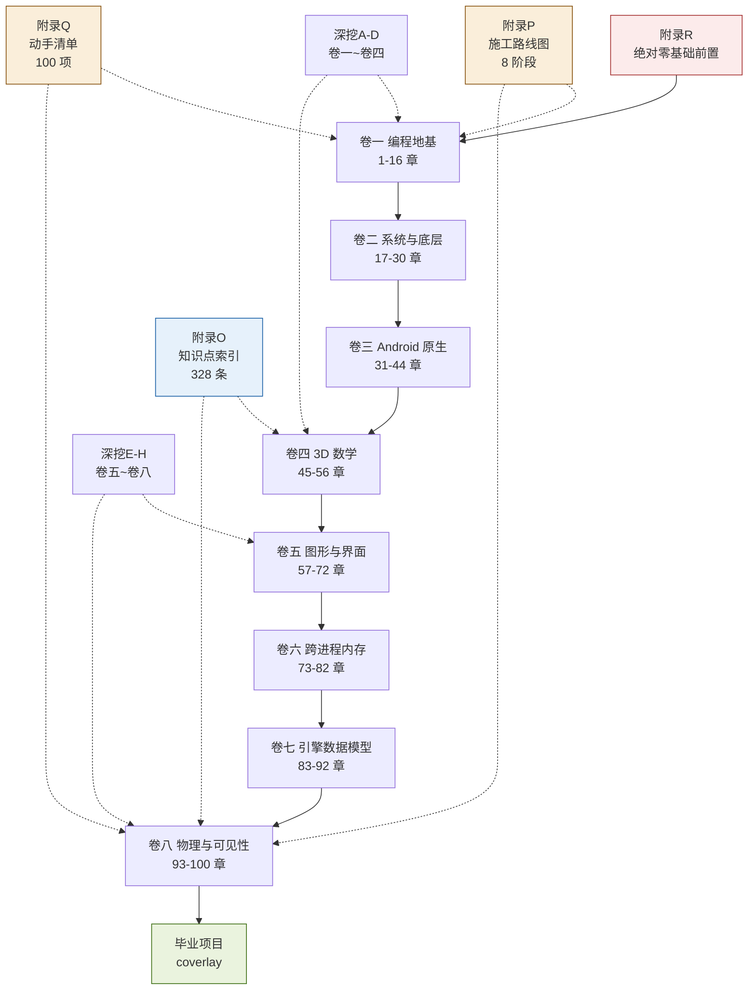

# 附录 T · Obsidian 进度看板

> [!abstract] 这篇解决什么
> 这套教程有 100 章、上千个验收项。**手工数进度太累。**
> 这篇教你用 Obsidian 的 **Dataview** 插件自动统计：
> 学到哪了、哪些验收项没勾、每天学了什么。
>
> **不装插件也能用**——末尾有手动版。

## 一、前置：安装 Dataview

**Dataview** 是 Obsidian 最流行的插件，能"查询"库里的笔记元数据。

### 安装步骤

1. 打开 Obsidian → 设置 → **第三方插件** → 关闭"安全模式"
2. 点"浏览"，搜索 **Dataview**
3. 安装 → 启用

装完后，本附录里的 ```dataview 代码块会自动渲染成表格。

> [!note] 为什么这套教程适配 Dataview
> 每章的 frontmatter 里都有结构化字段：
> ```yaml
> ---
> tags: [教程, 卷一, 指针]
> day: 3
> aliases: [ch05]
> ---
> ```
> `day` 字段让 Dataview 能按学习天数排序，
> `tags` 让它能按主题分组。

## 二、四个现成的查询

**把下面的代码块复制到你自己的笔记里**（不要直接放在这里读）。

### 2.1 全部章节总览（按学习天数排序）

```dataview
TABLE WITHOUT ID
  file.link AS "章节",
  day AS "学习日",
  tags AS "标签"
FROM "tutorial"
WHERE day
SORT day ASC, file.name ASC
```

**用途**：一眼看到全部 100 章的学习顺序。

### 2.2 按卷分组的章节数

```dataview
TABLE WITHOUT ID
  rows.file.link AS "章节",
  length(rows) AS "章数",
  min(rows.day) AS "起始日",
  max(rows.day) AS "结束日"
FROM "tutorial"
WHERE day
GROUP BY split(file.folder, "/")[1] AS 卷
SORT min(rows.day) ASC
```

**用途**：确认每卷的章数与时间跨度。

### 2.3 未完成的验收项（最实用）

```dataview
TASK
FROM "tutorial"
WHERE !completed
```

**用途**：列出**所有还没勾选的验收项**。
学完一章就把清单勾掉，这里会自动减少。

### 2.4 已完成项统计

```dataview
TABLE WITHOUT ID
  length(filter(rows, (r) => r.completed)) AS "已勾选",
  length(rows) AS "总数",
  round(length(filter(rows, (r) => r.completed)) / length(rows) * 100, 1) + "%" AS "完成率"
FROM "tutorial"
FLATTEN file.tasks AS tasks
GROUP BY true
```

**用途**：总体完成率。

> [!warning] 语法可能随 Dataview 版本变化
> 上面第 4 个查询用了较新的语法。
> 如果报错，换成这个更简单的版本：
> ````markdown
> ```dataview
> TASK FROM "tutorial" WHERE completed
> ```
> ````
> 它会列出**已完成**的项，你数一下也能知道进度。

## 三、三个自定义查询

### 3.1 只看某一卷

```dataview
TABLE WITHOUT ID file.link AS "章节", day AS "日"
FROM "tutorial/卷四-3D数学"
WHERE day
SORT day ASC
```

把路径换成任意卷即可。

### 3.2 按标签找章节

```dataview
LIST
FROM #指针 OR #内存 OR #对齐
```

**用途**：学完指针后，用标签找出所有相关章节做复习。

### 3.3 找出"有验收清单但没勾"的章

```dataview
TABLE WITHOUT ID file.link AS "章节",
  length(filter(file.tasks, (t) => t.completed)) AS "已完成",
  length(file.tasks) AS "总数"
FROM "tutorial"
WHERE length(file.tasks) > 0
SORT (length(filter(file.tasks, (t) => t.completed)) / length(file.tasks)) ASC
```

**用途**：按"完成率从低到高"排，最上面就是**最该补的章**。

## 四、一个完整的学习仪表盘（可复制）

新建一个笔记 `我的学习看板.md`，粘贴下面全部内容：

````markdown
---
tags: [看板]
---

# 我的学习看板

## 总进度

```dataview
TABLE WITHOUT ID
  length(rows) AS "总章节",
  length(filter(rows, (r) => r.completed > 0)) AS "已开始"
FROM "tutorial"
WHERE day
GROUP BY true
```

## 已完成的章（按天数）

```dataview
LIST
FROM "tutorial"
WHERE day AND length(file.tasks) > 0 AND length(filter(file.tasks, (t) => !t.completed)) == 0
SORT day ASC
```

> 一个章的**全部验收项都勾上**，它才会出现在这里。

## 正在学的章

```dataview
LIST
FROM "tutorial"
WHERE day AND length(file.tasks) > 0 AND length(filter(file.tasks, (t) => t.completed)) > 0 AND length(filter(file.tasks, (t) => !t.completed)) > 0
SORT modified DESC
LIMIT 3
```

## 还没勾的验收项（前 20 个）

```dataview
TASK
FROM "tutorial"
WHERE !completed
LIMIT 20
```

## 今天修改过的笔记

```dataview
LIST
FROM "tutorial"
WHERE file.mtime >= date(today)
SORT file.mtime DESC
```
````

**这个看板会随着你勾选自动更新。**

## 五、不装 Dataview 的替代方案

如果不想装插件，用这两个办法：

### 方案 1：用 Obsidian 内置搜索

在搜索框里输入：

```
path:tutorial "- [ ]"
```

会显示**所有还没勾选的项**所在的文件。

或者：

```
path:tutorial "[x]"
```

显示已完成项。

**保存为搜索**：搜索框右边点"..." → 保存查询，以后一键调出。

### 方案 2：用手动表格

每学完一卷，在 [[附录Q-动手任务总清单]] 的"完成度追踪表"里填一行：

| 卷 | 任务数 | 已完成 | 完成率 |
|---|---|---|---|
| 一 | 16 | 14 | 87% |

**虽然是手动的，但比不追踪强得多。**

## 六、学习地图（Mermaid 总图）

这张图把整个教程的关系画出来了（Obsidian 原生支持 Mermaid）：



**怎么读这张图**：

| 线条 | 含义 |
|---|---|
| 实线 | 必须按顺序（八卷主线） |
| 虚线 | 随时查阅的辅助材料 |
| 红色框 | 完全零基础的人从这里开始 |
| 橙色框 | 执行类工具（施工 + 进度） |
| 蓝色框 | 检索类工具（知识点） |
| 绿色框 | 终点（毕业项目） |

## 七、五个提高效率的 Obsidian 技巧

### 7.1 把章节钉在侧栏

学某一卷时，把该卷导航页**拖到右侧边栏**，
这样随时能看本卷地图，不用来回跳。

### 7.2 用"关系图谱"看掌握度

`Ctrl+G` 打开关系图谱。
**孤立的节点**（没有链接的笔记）说明你还没读——
本教程每章都有双链，所以图谱能直观反映你的阅读范围。

### 7.3 用 Callout 做个人笔记

学完一章，在文件末尾加自己的笔记：

```markdown
> [!note] 我的理解（2026-09-14）
> 指针的 +1 加的是"一个元素的大小"，这点我原来理解错了。
> 之前以为加 1 字节。
```

**不要改原文，只加自己的段落**——这样教程保持原样，
你的理解能叠加在上面。

### 7.4 用标签建立自己的索引

给读过的章加自己的标签：

```yaml
tags: [教程, 卷一, 指针, 已读, 需复习]
```

然后用 Dataview 或搜索 `tag:#需复习` 找出所有要复习的。

### 7.5 用"分屏"对照代码

学某一章时，左边开教程，右边开对应的项目源码文件：

```
左：tutorial/卷六-跨进程内存/第74章-process_vm_readv与writev.md
右：jni/include/My_Utils/SysHal.h
```

**边读边对照真实代码**，效果比只看教程好得多。

> [!tip] 最有用的一条
> **在 [[附录Q-动手任务总清单]] 里勾选**——
> 那份清单是"学习进度"的唯一真相来源。
> Dataview 看板只是它的可视化。

→ 返回 [[00-开始之前]]
